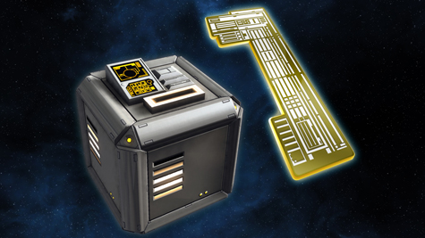
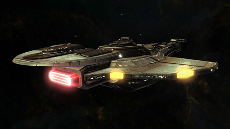

# STO: Red Gift Box, v2. Now with more cash needed!

[caption id="attachment\_10073" align="aligncenter" width="475" caption="It'll cost you to open this box."][/caption]

At the winter holiday event. Cryptic dangled a Jem'Hadar starship in front of the players. "Run the race in Q's Winter Wonderland," went the line, "and you will win a gift box that could contain this highly desirable ship!" The chance of that race dropping one of the red gift boxes was less than 1%. The chance that the red gift box, once obtained, would have a ship inside was far less than 1%. You could \_buy\_ gift boxes for $1 each. On the forums, people reported spending between $50 and $200 for red gift boxes until they obtained one of those ships.

Most ended up with stacks and stacks of useless items, and no ship. I was one of those; I only spent about $30 on red gift boxes. That was my wake-up call. All that money for nothing. Never again.

At least there was a really, really small possibility of obtaining the ship for free.

Along with the new feature episode this weekend comes the [Cardassian Lock Box](http://www.startrekonline.com/node/2864). This will drop as loot in the game. The lock box can contain:

 * A box with a Cardassian Galor class cruiser starship.

 * A box with a powerful cross-faction starship console.

 * A box with a Crossfire Tribble.

 * A Duty Officer Pack just like the ones sold in the C-Store.

 * A Large Commendation Boost

 * A smaller Commendation Boost

 * A Skill Point Boost

 * A box with a shuttle pet.

 * A box with a Dilithium Horta companion pet

 * A box with a Sehlat Cub companion pet

 * A box that when opened unlocks the Deep Space Nine Federation Costume Pack for the account.

 * A Shield Pack box. This box contains a random blue or purple quality shield for a starship or personal shield for ground use.

 * A box with a stack of Gamma Quadrant commodity items for use in Duty Officer missions.

 * A box with a stack of double bonus consumables

More detail on these options [at this link](http://www.startrekonline.com/node/2864), but it boils down to boxes containing the ship, and boxes not containing the ship. You can certainly expect you will open boxes not containing the ship hundreds of times before opening a box that contains the ship, the Cardassian Galor-class cruiser.

The boxes drop for free. But opening them costs cash -- 100 CP per master key. That's a bit over a dollar per try. How much is this ship worth? A week's wages for something that is pretty comparable to the Excelsior-class ship already in the C Store.

[caption id="attachment\_10074" align="aligncenter" width="475" caption="The Cardassian Galor-class cruiser"][/caption]

it's not a bad ship, the Galor ([full details here](http://startrekonline.com/node/2866)). It's appropriate to put it in the cash shop, the game having gone free to play, after all. What I object to is the lotto aspect of it. If you think the average player will spend $100 (random number pulled from the air, likely on the low side) on this ship, put it in the cash shop, charge $100 for it, and everyone who wants one can send the benjamins your way.

Trying to \_trick\_ players out of their money, though -- that's low. Yes, it's done in lots of other F2P games, and it's low for them as well.

The forums are, predictably, on red alert. [61 pages of stunned and angry players](http://forums.startrekonline.com/showthread.php?t=252981) as of this writing, many still reeling from the Red Gift Box scandal and wondering how Cryptic could pull the same stunt twice in a row. They're hoping to trap the new F2P users, say the conspiracy theorists.

Longasc of the German fleet Rhodanjugend (not the real fleet name) plans to sell the boxes on the exchange to people with too much money, and perhaps earn enough to BUY the ship outright from those who choose to sell them after they finally win them. Sounds like a plan to me.

