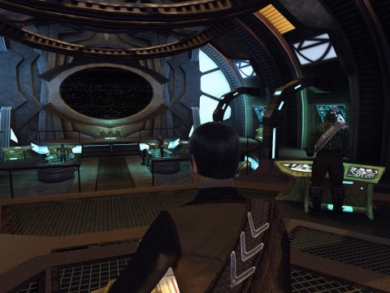
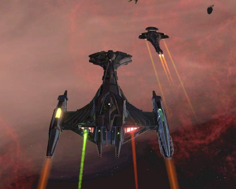
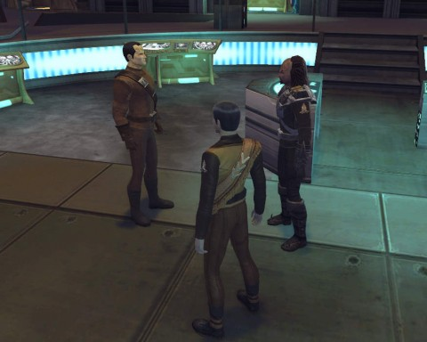

# STO: A Case of Galor Envy

[caption id="attachment\_10101" align="aligncenter" width="480" caption="Cardassia is MINE!"][/caption]

Okay, no, this isn't MY Galor, but that of my good friend Longash. I'm not quite sure on all the details, but I believe he borrowed money from an honest looking Ferengi to get the ship. Anyway, like the holiday Jem'Hadar Bugship, the Cardassian Galor cruiser has a custom bridge, along with some uniquely Dominion design features such as no chairs. Except for the captain.

[caption id="attachment\_10100" align="aligncenter" width="480" caption="Bortas and Galor"][/caption]

The slippery thing moves like a FISH. Long got consoles and doff powers and whatnot to give the ship an incredible 21 degrees/second (366 radians/kilosecond metric) turn rate. That's a tighter radius than most escorts. Combined with unique weapons and all the powers normally reserved for big, massive ships like the Bortas I'm flying here, this is one heck of a ship.

[caption id="attachment\_10102" align="aligncenter" width="480" caption="Narad@Heretic, Krontar@Tipa, and Longash on the bridge of the Pandora"][/caption]

Special enough that a dev -- Heretic -- came by to visit. He was getting a bridge officer trained by Longash. Because (as Heretic pointed out) even devs need their bridge officers trained. Yeah, but how much did he pay for his ship? His Galor is running with a complete Cardassian crew, from captain down to ensign.

Prices for the Galor have fallen from 800 million energy credits to about a tenth that today. Soon everyone who wants one will have one.

I'm still holding out for the bugship.

