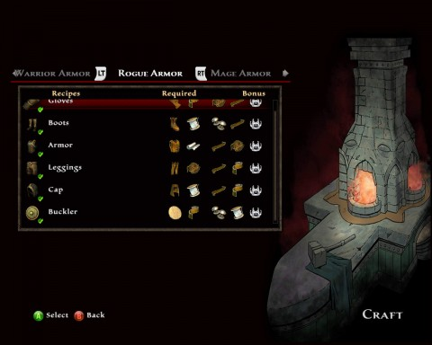
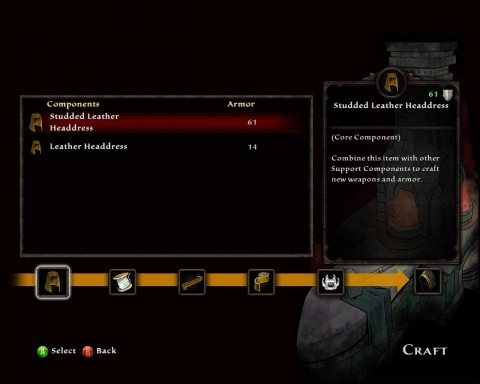
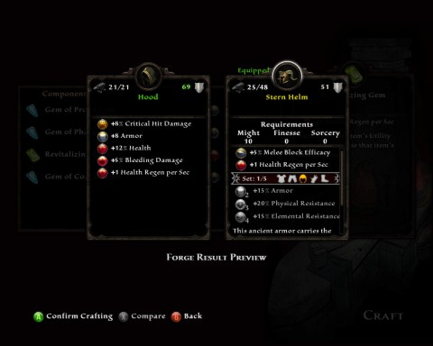

# Crafting in Kingdoms of Amalur: Reckoning

*Posted by Tipa on 2012-02-14 08:11:06*

[caption id="attachment\_10105" align="aligncenter" width="480" caption="Recipe screen"][/caption]

I've really been impressed with Kingdoms of Amalur: Reckoning's crafting. The whole game has actually impressed me more than I thought it would, so good job, Big Huge Games, 38 Studios and Electronic Arts.

There's a couple kinds of crafting common to RPGs; one is where there are fixed recipes and the same item is produced every time -- EverQuest, World of Warcraft and Skyrim share this model. This turns crafting into a commodity. In MMOs that use this model, there's no particular reason to go to any specific crafter to get something made. If they have the skill, they can give you the item, identical to that produced by anyone else.

RPGs like Star Wars Galaxies have a model where the general function of an item -- a template -- is provided, but the actual details are determined by the crafter and their skill. Reckoning follows this latter model.

[caption id="attachment\_10106" align="aligncenter" width="480" caption="Making a hood"][/caption]

Equipment in Reckoning is created via the Blacksmithing skill. Items can be made with from 2 to 5 components, depending on your skill. Each component adds another stat or effect to the item. In the screenshot above, I'm making a new hood for my rogue. I start out with the base component, a leather headdress. Components can be found as loot or by disabling traps (with high detect hidden skill), but are normally created by salvaging unwanted gear. 

I toss almost everything I find into salvage, because I like having all my options available when I go to the forge.

At each step, I make decisions about the final product. Here I select a high armor class headdress over a lower armor class one. I will make some trash loot for selling with the trash components.

[caption id="attachment\_10107" align="aligncenter" width="480" caption="Comparing the finished product"][/caption]

The final crafting component is a gem, found as loot or created with sagecraft. I'm trying here to replace a Might-based helm (from a set) with a Finesse-based hood, so I can at some point switch from my Might/Finesse build to a Finesse/Sorcery build without losing all my gear. It was important to me to not lose the old helmet's innate health regeneration, as your health doesn't regen quickly on its own.

Luckily, I had stumbled onto the formula, through experimentation, for +1 health regeneration gems.

[caption id="attachment\_10108" align="aligncenter" width="480" caption="Name it!"][/caption]

If I didn't like what I made, I could have backed out the entire process and lost nothing, or tried different components, but in this case it's a clear upgrade and is a great alternative to the old helmet.

All that's left is the naming. The hood joins the rest of my "Terrapin Hide" armor -- almost everything I equip has been crafted. In a couple of levels I'll unlock master crafted gear... and I fully expect that to bring me through the rest of the game.

No, you aren't required to craft. Decent gear drops throughout the game. But if you want the best gear available at all times, you will need to come to the forge. It's painless.

