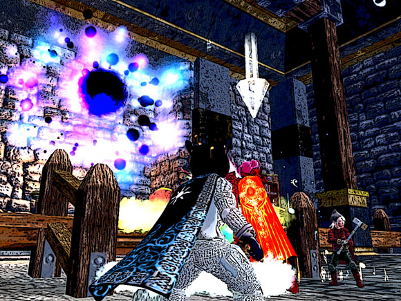

# EQ2: Terror from Beyond the Portal

> They dealt with the terror in their homes and in their hearts... but could they deal with the TERROR FROM BEYOND THE PORTAL?

Gah... I have to remember not to post while listening to X Minus One... ([Time and Time Again](http://ottolejeune.com/index.php/downloads/033_time_and_time_again/) by H. Beam Piper ftw).

I started getting these odd tells from officers when we were in Freethinkers Hideout. "Are you scout specced?"

I'm a troubador. I spent 100 AAs to make mages into finely tuned death machines. Scout specced... what, they think I woke up as a dirge?

If I were "scout specced", the only scout I'd be speccing is ME. Drop some of those spellcasting lines, go up the intelligence tree, maybe play around in the agility line... yeah... that would be scout specced, Dina-style.

While I was trying to explain this, I was swapped with another troubador -- some pickup troub -- and placed in a group with scouts.

Well... okay... guess I'll sing my attack speed song and hope for the best...

This was the Portal group. Here's how this named goes down.

She's just this gal, standing there, and we're this huge raid. What could possibly go wrong?

This gal has some tricks, though. Every few seconds, she sucks out someone's soul like, say, mine, and sends it to kill them. And you're frozen in terror while your soul is about, only able to move and attack at a snail's pace. All you can do, is die.

But that's not all. Every half a minute or so, she summons help through a mystic portal. And that's where my group came in. Our job was to catch the adds and kill them before they got into the raid. This all puts a time limit on the raid -- sooner or later, the souls will kill too many people, who will be rezzed with low power. So if the raid dps isn't 20K or better -- well, it's going to be painful.

Our dps hovered between 11K and 14K.

And yeah, it was painful.

