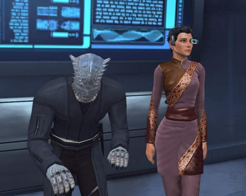
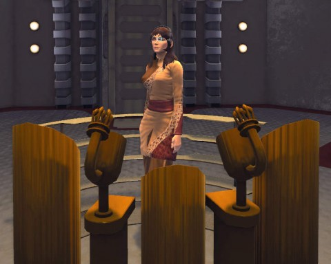
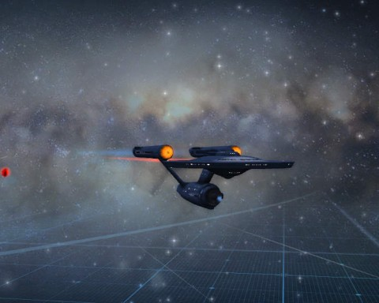

# Star Trek Online: Enter the Vorta

*Posted by Tipa on 2012-03-01 08:21:12*

[caption id="attachment\_10136" align="aligncenter" width="480" caption="Vorta Heerza Huo"][/caption]

I love MMOs. I love *leveling* in MMOs. Shepherding a character through her own unique path, growing in power and becoming more awesome -- that's what keeps me in a game. Once I've finished with the leveling, more often than not I'm done with the MMO. The max level grind can't hold me. World of Warcraft, EverQuest, EQII, Rift, Wizard101 -- once I hit the top, I was ready to move on.

What's different about Star Trek Online? The customization, to be sure -- you can build nearly any alien ever seen in the Star Trek universe, and mix and match the hundreds of parts to make your own unique creature.

My first character was a regular Andorian, though light-skinned so she might be an Aenar (who live in relationship with ethnic Andorians similar to ethnic Japanese with the Hokkaido Ainu). My second character was a Klingon -- but not a modern Klingon. I went old school. I had pictures of the Klingons from the original series as models and went back to the 60s with my Klingon. Sometimes I see other old schoolers around...

My third character, standard Vulcan. She flew the "Star Trek Enterprise" version of the Enterprise, and unlike Enterprise's T'pol, T'pral wore a uniform. She's currently on detachment to the Bajoran militia for the duration of the Dominion crisis.

[caption id="attachment\_10137" align="aligncenter" width="480" caption="Heerza in happier times"][/caption]

In the center of that crisis is my fourth character, Heerza, a Vorta. Put in charge of a squadron of Alpha Jem'Hadar during the last days of the Dominion War, Heerza led many attacks against entrenched Alliance positions both on ground and in space, until finally crashing on an unexplored Class L planet. Though the ship was damaged beyond repair, Heerza and her surviving Jem'Hadar were able to rig stasis pods and survive until a Federation exploration ship discovered them while on a mapping mission.

Knowing that she faced certain euthanation should she return to the Gamma quadrant (her successor clone would certainly see to that), Heerza elected to stay in the Alpha quadrant, making a living as an adviser on Dominion affairs and staying below the radar, hoping not to attract the attention of her masters.

The return of the 2800 has changed all that forever. Now she must confront the Dominion and stop a war, even if it should cost her her life.

And that's why I'm still with Star Trek Online, you see. It's that rare, non-sandbox MMO where I can tell my own story.

[caption id="attachment\_10138" align="aligncenter" width="480" caption="Heerza's first ship"][/caption]

Also, seriously? Heerza's first ship in the game was a refurbished Constitution-class starship, a sister to the Enterprise itself! Just can't get cooler than that. Well, it would be cooler if Cryptic would let me buy a Dominion ship... Maybe someday.
