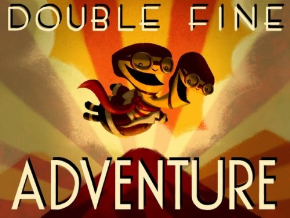
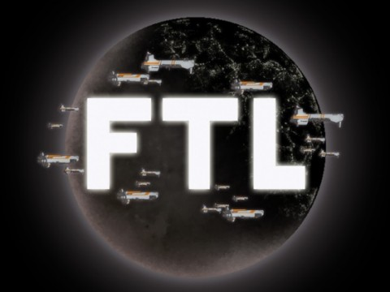

# Will Kickstarter usher in the age of boutique gaming?

In Tim Schafer's first post-funding update for his Kickstarter-funded old school adventure game, he's stunned and overjoyed that the project attracted over $3 million in funding for a desired level of just $400,000. A recently cancelled game had left the future of Double Fine uncertain; there would have to have been layoffs, but now it's all saved. Double Fine's success led to equally successful Kickstarters for such nostalgic titles as [Wasteland](http://www.kickstarter.com/projects/inxile/wasteland-2), [Shadowrun](http://www.kickstarter.com/projects/1613260297/shadowrun-returns) and even [Leisure Suit Larry](http://www.kickstarter.com/projects/leisuresuitlarry/make-leisure-suit-larry-come-again).

There's a lot of excitement and discussion over a new era of gaming, where the players essentially pre-purchase games before they are developed (or in many cases, even thought about much). Is it sustainable?

In the video, Schafer mentions offhandedly that their recent Brutal Legend game cost $20 million. $100,000, on the other hand, would fund a simple iPhone-like game. $3 million, then, would fund a game a seventh the size of Brutal Legend, or a really, really good iPhone game.

The DF Kickstarter attracted 87,142 backers after a HUGE media push. Schafer mentioned that Full Throttle had been considered a success when it sold a million copies, but that Game of the Year Grim Fandango was considered a failure at just half that. The Kickstarter attracted a \_tenth\_ the number of backers as copies of Full Throttle sold.

Double Fine will have to attract many multiples of new players once their game has been released in order for Kickstarter-funded projects to be more than a stopgap development effort in between bigger budget games for AAA developers. $3 million is record setting for a crowd funded project, but just pennies compared to big budget games.

Crowd funding, whether via Kickstarter or some other means, might keep the lights on for established game developers. The real puzzle is how to use this to fund amateur game developers and make available games that would never have been made.

For unknown developers, the outlook isn't that great. I'll be going over the projects I have backed and those I have NOT backed in the next few days, but what looks easy if you are a well-known game developer is less so if you're just getting your start.

A great idea isn't enough.

I'm a big fan of ABC's [Shark Tank](http://abc.go.com/shows/shark-tank). Hopeful entrepreneurs try to attract funding from one or more investors, who (as the show's narrator relentlessly repeats at the opening of each show) are deciding to spend their own money on someone else's dream.

When someone comes to them with a finished or nearly finished product, have some sales behind them and a plan to expand and to spend an investment wisely, they usually get a deal. Come with an idea but little ability to execute and there's rarely a happy ending.

The makers of [FTL](http://www.kickstarter.com/projects/64409699/ftl-faster-than-light), a very indie game from a couple of developers in Shanghai had a video, a live demo of the game thus far running on OnLive for awhile, and an award at the Independent Games Festival; they got funded.

[Your World](http://www.kickstarter.com/projects/120873716/your-world), a random collection of inspiration from pretty much every game this guy had ever played or thought of, looking for $1.1 million and little ability to execute... probably won't be funded. I'll be writing about this one later.

Kickstarter offers a new way of getting products funded, but in the end it doesn't change the world. You still need to have people with a vision and the ability to execute. There will always be room for new game developers to get a couple friends together and build something amazing on nights and weekends, then put it into the world via Kongregate, the App Store, XBLA, Indie Bundles and so on. If you build something great, and have a way to get the word out, people will want to play your game.

