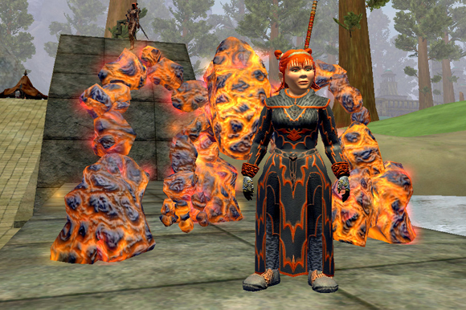
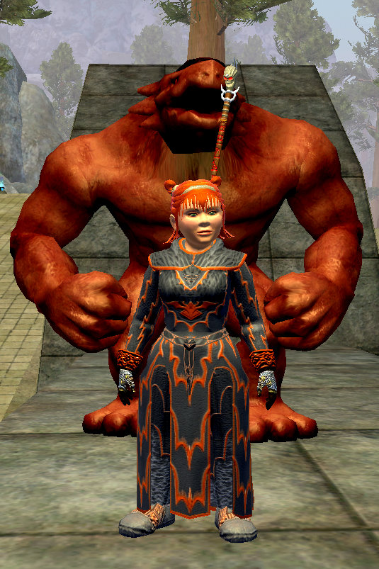
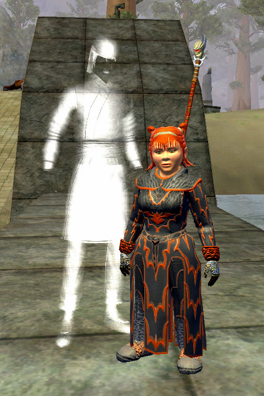
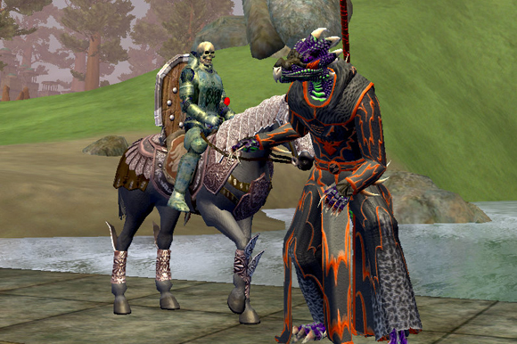
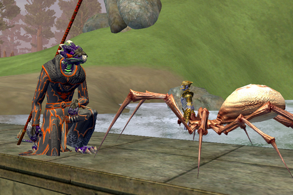
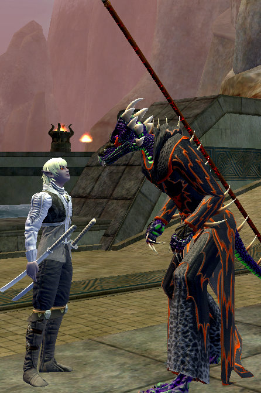

# EQ2: New Summoner Pets

The summoner pets introduces in Rise of Kunark, like from previous expansions, draws from the expansion itself. The robe our conjurer and necromancer wear is the tier 8 handcrafted robe.

Conjurer Mage Pet:

More after the jump.

Conjurer Tank Pet:

Conjurer Scout Pet:

Necromancer Tank Pet:

Necromancer Mage Pet:

Necromancer Scout Pet:

