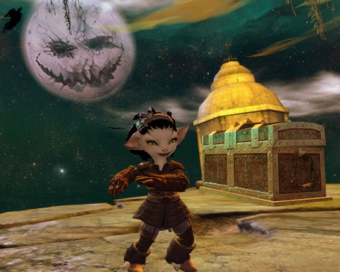
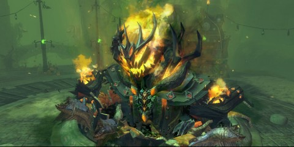
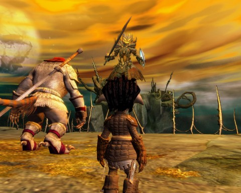

# Guild Wars 2: Ascent to Madness

*Posted by Tipa on 2012-10-29 06:21:04*

[caption id="attachment\_10395" align="aligncenter" width="480"] The Dance of Madness[/caption]

There's a rhythm I get to in Guild Wars 2; bring up the map, look for a blank spot, and go there. Fill the hearts, look at the vistas, do the skill challenges, sell and move on. If there's an event nearby, try to get to it and join in.

Having unlocked all my weapon combos and decided upon favorites, that's done forever. My gear is limited by my level, so nothing I can really do about that. The story missions are fun, but most of the time in GW2, I'm just on auto-pilot. So it's nice when things like the Halloween event comes by to break up the flow.

There's been a lot of concern about how players would have to be in specific places at specific times in order to fully participate in the Halloween event. I just pretty much ignored it because I thought I (correctly, it turns out) would be too low level for it.

[caption id="attachment\_10396" align="aligncenter" width="480"] The Mad King[/caption]

But, thanks to a friend (/wave @Longasc), I was pulled into the final Halloween event, the Ascent of the Mad King. He appeared in Lion's Arch, and I can't remember if there was a battle there or not. Regardless, he soon finished being mean or whatever, and poofed through some haunted doors.

Well, nothing to do but to follow him. Valnora (80 ranger), an Aztec Charr (16 something?) and I (21 thief) entered the portal and found ourselves in a Halloween nightmare. All of us had been leveled to 80 for the instance, but the crappy gear on us two lowbies meant Valnora had to do most of the work.

First was "Mad King Says", which I failed at, even though I did the emotes when the Mad King said "Mad King Says" and did not do them when he didn't. Either way, I got attacked by Halloween creatures. Eventually he tired of this and decided to just deliver a beatdown.

That just continued my litany of death. Die from being feared off the edge. Die from missing a jump. Die from being swarmed by monsters while balancing on a shaky chain above an eternal chasm. Die from pumpkin bombs. Die from finding myself beneath the Mad King after he teleported.

But we did eventually kill him, got the level 45 loot from his corpse and more level 45 loot in a hidden chest far below. The level of the loot seems a little arbitrary. If you're 80, it's worthless. If you're a lowbie, it just has to sit in your bank forever. If you're level 45, you'd be best just buying the stuff off the auction house, as there has to be a vast oversupply of level 45 gear after all these events.

[caption id="attachment\_10397" align="aligncenter" width="480"] In the Mad King's realm[/caption]

Afterward, @Longasc brought us to the Mad King's Labyrinth, where we killed things until the huge number of people crashed the game. Everyone was upleveled to 80. Most of the people were low level. Things died soooo slowwwwwly.

Stuff like this really makes me miss Rift.

But, it was fun!

So was Rift, though.
