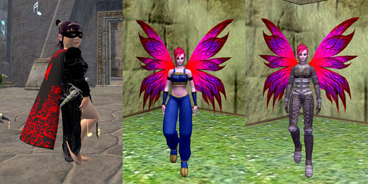

# EQ2: Tier 8 Tailoring

*Posted by Tipa on 2007-11-12 01:39:28*

I promise, this is the last screenshot of clothing :) I logged on tonight, scoured the broker for the rare hides and other stuff I'd need, and made some Tier 8 clothes.

The first is the level 80 dress -- BLACK! Finally! It looks great... well, considering it looks like every other dress (except all black), maybe it's not the most amazing thing in the world, but it matches my mask so I'm fine with it.

The Arasai in the middle is wearing the T8 mastercrafted gi. I'm not sure if tailors could make gis before RoK, but they can make a couple of them now.

The Arasai on the right, whom you might remember from the center picture, is wearing the mastercrafted woven leather armor. Very drab. I was hoping for something a little more distinctive... the T7 stuff looks far better than this.

If my sage gets copied over before beta ends, I'll try and see if I can make the Adept III pets for my summoners, and see what slightly better pets might look like.

