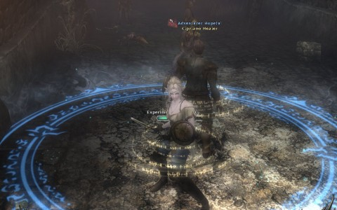
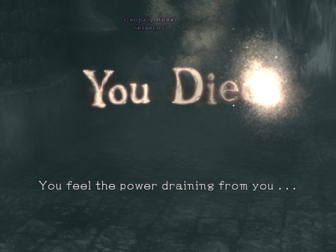
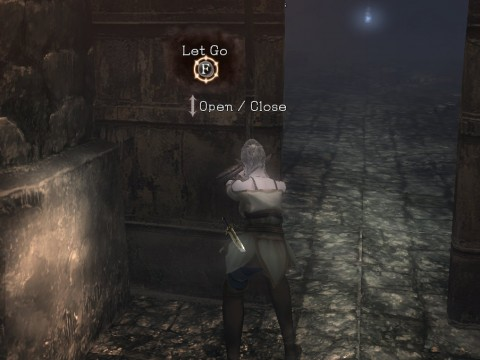
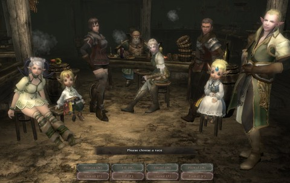
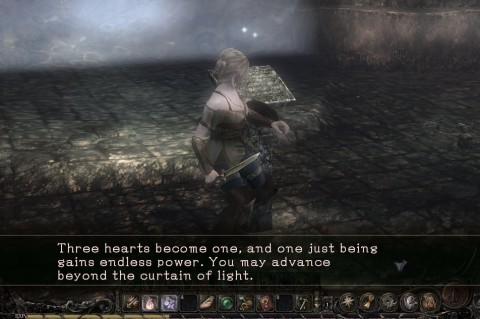

# Wizardry Online: Are You Experienced?

*Posted by Tipa on 2012-12-05 23:25:34*

[caption id="attachment\_10486" align="aligncenter" width="480"] Back to back in a healing circle, enemies all around[/caption]

Gamepot's Wizardry Online (published in North America by Sony Online Entertainment) wants you to know that it is a hardcore MMO. With permadeath. If you play this, you will die. In real life. Really. Unless you're hardcore enough. Permadeath.

This might intrigue you. They aren't lying. This is a hardcore game. There is permadeath. But the game is also somewhat... annoying. Still, it may be your cup of mead, if you long for the days of another hardcore MMO, one called EverQuest.

The two games share a lot of features. In EverQuest, trash mobs outside the city gates could hand you your lunch. In Wizardry Online, I couldn't even get through the tutorial dungeon until I died (what? no permadeath? No, it's not that easy to lose your character). Once I died, I blundered around until I leveled while drinking from a health fountain, spent some skill points, and was finally able to kill the mobs. Then the dungeon timed out and I had to restart, and finished it, easily.

The first open dungeon was, like EverQuest, dominated by people forming groups at the entrance and taking on the trash mobs that spawned there. Since you don't normally regenerate health or mana, moving in deeper was a perilous thought, especially since running isn't an option. Mobs will follow, you will run into other mobs, and eventually die tired.

[caption id="attachment\_10487" align="aligncenter" width="480"] You Die.[/caption]

If, or when, you die, you become a disembodied soul. Your body lies where you died, where it can be looted by anyone who comes across it. (If you have not given permission, the looter may be branded a criminal, but they still get your stuff). Your soul must make it to a Guardian Statue within a certain amount of time. If you take too long, your soul turns to Ash. If you find the Guardian Statue and touch it, it gives you a balance showing the percentage chance you will be revived, which can be influenced by donating magic items at the same time. If you fail at revivification while a Soul, you will become Ash. If you fail while Ash, you lose your character.

Permadeath isn't easy, but it can happen.

So; quests are way above your level, grouping is vital, and your body can be looted and you can lose all your stuff. Original EQ.

Wizardry Online STARTS there... and then gets harder.

I mentioned no innate health or mana regeneration. There is a third stat, OD, used for shield blocking and dashing, which does regenerate over time. But for the others, you either have to imbibe potions, buy and use "camps", or leave the dungeon and rest at an inn. Resting for free brings you only back to half health and mana. Getting full health and mana requires paying gold.

I ran the first dungeon with a pick-up healer (my character is a mage). We killed a lot of stuff and received about six gold, plus two unidentified pieces of armor for me. Resting at an inn for full health and mana requires 300 gold. So most of the time, you're going to be only at half strength.

[caption id="attachment\_10488" align="aligncenter" width="480"] Open, Sesame. Wait, Close, Sesame. CLOSE, DAMMIT.[/caption]

Wizardry Online does have a cool door mechanic. You grab on to it, then shove it open or closed a little at a time. You could send your party thief out to pull, close the door on them, then have them struggle to open it from the other side with monsters beating on them while you hold the doors closed. When your friend dies and the monsters wander off, loot their body. Easy money.

The game does warn you that your fellow adventurers may turn on you. Their recommendation: become very strong.

This is the key to Wizardry Online. Grind mobs until you can one-shot them, then move a little deeper into the dungeon, and so on. Don't expect to breeze through content just because a quest tells you to. You'll die. Even in a group.

Patience.

[caption id="attachment\_10489" align="aligncenter" width="480"] Character creation[/caption]

Character classes are the typical four you'd expect -- fighter, mage, priest and thief. The races are also standard -- jacks of all trades humans, magic using elves, fighter/priest dwarfs and gnomes, and tiny race (Porkul) thieves. Any race can become any class (and even change classes later), and you can keep re-rolling your stats to get better ones. In fact, this is something you need to do.

Especially important since, as you level, some of your stats can DROP. As a mage, my vitality slowly drained away as I leveled. There was another stat I lost, too. Strength? Don't remember. But as you grow into your profession, you move further away from your base stats, so best make those best stats as good as possible.

[caption id="attachment\_10490" align="aligncenter" width="480"] Puzzles![/caption]

The game, however, has a lot of little annoying things. Cut scenes type out conversations with agonizing slowness. After the third or fourth, I began to fear cut scenes. Regular NPC conversation can be clicked through, but not the cut scenes.

Movement is Asian standard -- you move forward and hold down the turn keys at the same time. It's not hard to become used to it, but WoW, EQ2 and others have defined a normal set of keys, why not use that?

Zones transitions are slow and frequent. There is a cash shop merchant in every zone. The one item they sold (for real money) was a superior camp site, for better, faster healing in dungeons. You will not be able to do dungeons without camp sites. You will be buying them with real money.

It's a free to play game. Didn't pay for the box, didn't pay for a subscription, Gamepot and SOE need to get you to pay for \_something\_. And that something is going to be healing, or better gear to help you survive better. Just relax and expect it. Things are bought with SOE's "Station Cash", on which they have frequent sales.

Don't want to pay to make your life easier? Just take it slowly, level up on mobs at the zone, run out to take a unrefreshing nap on the floor of an inn for free, and hesitate to move into a dungeon until it is trivial enough for you to one shot everything on the way there (you can port out of a dungeon to town once every twelve hours, so maybe you won't have to fight your way back out again).

I can't say I had fun in the couple hours I played, but I did feel challenged. With a patient group, this could be a good alternative to Turbine's Dungeons & Dragons Online.
