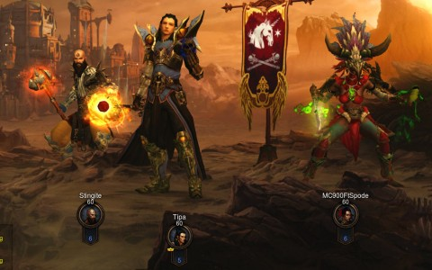
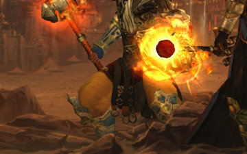

# Diablo 3: It's an Inferno out there!

*Posted by Tipa on 2012-12-31 12:59:31*

[caption id="attachment\_10545" align="aligncenter" width="480"] At the Start of Act II[/caption]

Our Barbarian was missing again this week, leaving us a Gang of Three as we moved into Act II, Inferno, Diablo 3. You may remember that we'd flown through Hell mode in Monster Level 10, which made the game just a little more difficult, while adding loads and loads more loot and cash to the monster drops.

This being Diablo 3, the vast majority of the loot was trash, differing really only in the background color (clear, blue, yellow) that determined how much it would sell for to its only buyer, the merchant at the camp.

The auction house in game is nearly dead now; items that used to sell readily now no longer sell at all, and a bit of the fun has gone out of that part of the game. I ended my auction house career with about 2.5M gold in the bank, but all upgrades cost many, many millions of gear more, clearly put there by those brave few who still think they can make a killing transferring gear to and from the real cash auction house.

Too bad. I can't even access the real cash auction house because I haven't gotten an authenticator for my account. Not that I would ever spend real cash on Diablo 3 items.

Anyway, ML10 on Hell was fun and added a little necessary challenge to the game. ML10 on Inferno was so bad that it took us fifteen minutes to clear the introductory trash mobs before we got to the first NPC in Act I, Inferno. We dropped the difficulty to ML3 and continued on, getting some decent loot for the first time -- some legendaries, even.

As we progressed through the first act, though, we started dying a lot. Down we went to ML2, still died a fair amount, but we made progress. When we came to the Butcher fight, the boss of Act I, we had to step it down to ML1. That wasn't quite enough. We removed it entirely, and the fight was easy.

I did finally have a reason to change my spells from a Disintegrate-based build to an AE Blizzard-based build. This was a suggested build from the forums, but I was happy sticking with the all-destroying Disintegrate laser beam as long as it worked.

[caption id="attachment\_10546" align="aligncenter" width="360"] Let's zoom in a little[/caption]

Spode was gleeful over how much more green his witch doctor was; she now even had green smeared over her thighs!

Yeah, pretty icky, but speaking of thighs, OMG, LOOK AT STINGITE'S LEGS! His monk must be more than a little bit FROG.

He could squeeze Volkswagens to death between those thighs. And so that was the theme of the night, as Stingite took the lead, crushing whole groups of monsters to glowing ketchup between those massive thighs of doom. Stingite, Lord of the Thighs.

We talked about raising the ML up to 1 or 2 again, but in the end decided to leave it at zero and just finish the game. We did the complete Act II -- we're so damn good at this game, now. We'll probably take the standard two weeks to finish the game, and then move on to the next game.

I THINK that might be DC Universe Online. It's one of a number of F2Ps under discussion. (And I should remember to add The Secret World to that list, now that it's F2P). People have suggested cool games like Planetside 2, but there's not much of a plot progression to that; can't really claim to ever come to an end of that game.

Though we never did come to an end of the plot in DDO; we just stopped playing it when Diablo 3 came out, which was always the plan.
