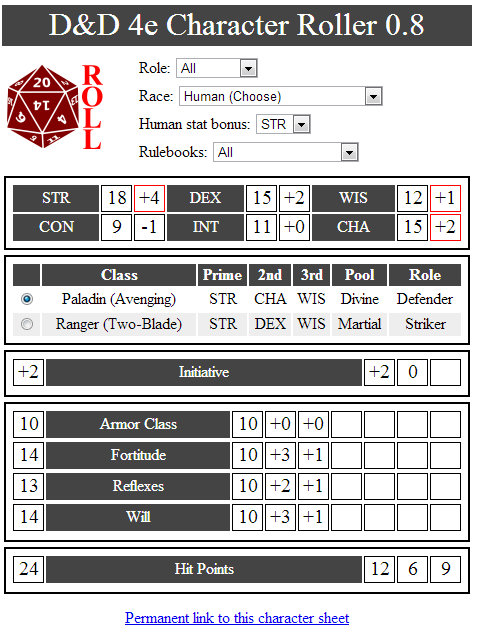

# D&D4e: It's time to slay the dragon. Again.

*Posted by Tipa on 2013-01-01 23:58:52*

I exaggerate a little. We probably won't be slaying a dragon, which I think it a little bit of false advertising, if you ask me. I know darn well there are going to be dungeons. Each dungeon should be equipped with at least one dragon, and that dragon should be informed that its lifespan shall be among the shortest. Not kobold short, but short enough. An ancient dragon should be one that has managed to see two years come and go before the party of steadfast adventurers fed it its own scaly tail.

That's how I see it, anyway. I guess I'm a little ready for some revenge. You may recall that the final battle with the big boss in the first outing with the Adventure Company ended with the sudden defeat of all of us good guys, and even Brynn's steady Magic Missile couldn't pull a win from that cluster.

But the mantle of the Adventure Company will be passing to a new legion of level 1 wanna-be heroes. Pursued across the Forgotten Realms by an army of undead, the army raised by a villain from a different dimension who we maybe didn't kill last time around.

I was so excited at being able to don armor and sword that I started thinking about my new character the very day the DM announced a new campaign. In fact, I figured it would be fun to make a little app to roll the dice for me. And as long as it was doing that, it could figure out all the little stats you have to fill in. And I might as well expand it a little so that it could suggest classes that could fit the rolls.

And you know, this is what I did on my Christmas vacation. I wrote [a Dungeons & Dragons 4th Edition character roller](http://chasingdings.com/cgi-bin/roller.py) -- and it isn't done yet. I have some ideas on how to fit hybrid characters in. It's built in server-side Python, using a Jinja2-based template engine with some Prototype Framework-based JavaScript on the client side making things happen when you select a specific class and wow, this is a really \_complicated\_ set of technologies, even given that I should have used jQuery instead of Prototype and I'm losing you, right?

Sorry.

There is an ulterior motive to this post, and I hope you will run the app and play around with some characters and get to wondering how it is you could take this character you make and play it with some great people online.

The four of us have all signed up once more, but we really could use someone else. All you need is the ability to voice chat in a Google+ hangout, which is really easy, and the D&D 4e Player's Handbook -- just the first one is all you need.

We used Fantasy Grounds II last time. I'm not sure we're going to use it again. But we may, and that costs a little additional money. But we may choose another solution, too. Hasn't been decided yet.

Last time we were all really just learning how to play D&D again, and most of us were bringing our MMO habits along with us. But really, everything we need to know is in that PHB, somewhere, and if you choose to join us for this adventure, we probably won't die so much.

We might still light an elf for good luck.

