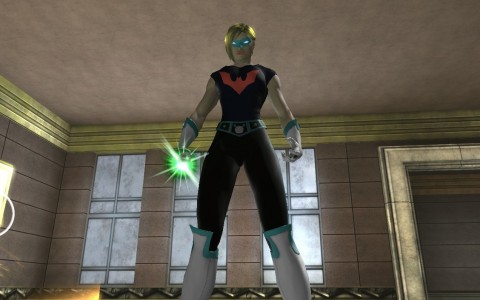
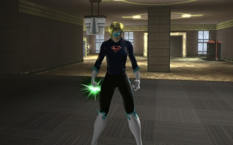

# DCUO: Grinding for Hoodies

*Posted by Tipa on 2013-02-08 17:57:35*

[caption id="attachment\_10659" align="aligncenter" width="480"] Batwoman T-Shirt[/caption]

[caption id="attachment\_10660" align="aligncenter" width="480"] Superboy Hoodie[/caption]

Ever since I heard that the only hope of my DCUO Green Lantern-"ish" character getting to wear the lantern symbol on her costume was to find a Green Lantern hoodie in The Vault, I've been in there every day.

The Vault is the only solo "On Duty" mission available. You can do it once a day, and it's just going in and smashing presents for cash and the occasional cosmetic item. It's supposedly set up by Joker for the villains and fourth wall-breaking Ambush Bug for the heroes, but it's only Joker for both sides once you get in, urging you on as you smash green and purple presents and avoiding bombs and giant bouncy balls.

I'm not any kind of expert on the DC Universe, but I don't remember any adventure where Batman smashed presents to get a different looking utility belt. I probably missed it.

Anyway, my character in her lair modeling the two shirts. No Lantern yet. Can't really pretend to be a follower of Superman/boy or Batwoman/girl because the glowing ring means she will always and forever be identified as a Lantern. Her mentor is Superman, though, so I am wondering how it was she got the ring.

Basic plot of the game is that Lex Luthor came back from the future and scattered "exobits" around, giving folks powers, right? So the exobits made my character grow a ring?

I guess that must have been exactly what happened, since they won't let her be part of the Corps, and her ring has WAY fewer powers than a real one does.

Anyway, not happy with the base. Haven't found any furniture for it, so it's really barren, but it also has really low ceilings. This really is unforgivable for a flying character. My vision of a base would be a several floor tall atrium, around which are built living quarters and such. Sort of like Alice's rabbit hole, except if she could fly.

As it was, she fell so incredibly slowly that she could take things off shelves on her way down to a soft landing, so maybe she could fly, a little, after all.
