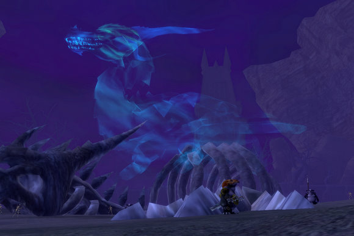
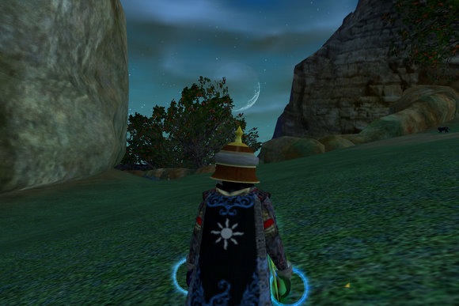

# EQ2: How did beta testers test Rise of Kunark?

*Posted by Tipa on 2007-11-16 08:41:48*

Rise of Kunark is a beautiful expansion, but the tuning has problems. Three days in, and I'm stumped as to how the tuning I've seen so far in the Kylong Plains and the Fens of Nathsar was done.

In the beta, I saw a lot of soloers, and a lot of people beta-buffing and grouping up for the dungeons. What I didn't see much of, was people playing the game as they would do when the game went live.

I've already talked about the problems with Karnor's Castle.

Last night, my plan was to log in and faction for awhile to get Teren's Grasp faction, but I got a group doing Fens quests nearly immediately.

The Fens, like the Kylong Plains, is covered with solo mobs. There are no mobs grouped with one another. There's no heroic mobs. I'm not sure if even the nameds were heroic.

When EQ2 launched, overland zones were a mix of solo, heroic and group mobs -- they were mixed-use zones. If you wanted to solo, there were mobs you could grind on. If you were in a group, there was plenty for you as well. Everyone got great experience according to their playstyle, and while you were soloing in a zone, you could be looking for a group in that zone as well. I loved the Thundering Steppes for this.

Over time, the player base moved on, and the zones were readjusted to be only solo mobs. This made sense. When nobody groups in a place, group-only content is wasted.

That's *not* where we are in RoK, yet. Last night I spent perhaps five hours doing quests in a full group in the Fens. There were lots of groups. I saw no soloers -- I'm sure there were some I didn't see -- but whenever we passed other people, they were grouped.

Since we were killing solo mobs, though, our experience bars barely moved, unless we were turning in quests. Grouping in EQ2 should, in my opinion, always be more rewarding than soloing. I've got nothing against soloing; I love soloing sometimes.

But couldn't RoK have launched with open zones filled with solo AND group mobs, so soloers would have stuff they could kill, and groups, stuff they could do? Five hours of grouping, killing continually, and I think my vitality might actually have *grown*, I was getting so little adventure experience.

Mixing solo and group content was something SOE knew well in 2004. And it was totally appropriate to move those group mobs to solo mobs as the usage of the zone changed.

RoK moved a little too quickly to solo-only zones. In a year, when the bulk of the playerbase has left Kylong Plains and the Fens of Nathsar, that would be the time to refocus these zones to the solo player. It was way too early to do it when people are eager to *group* in these zones.

That said. The Fens of Nathsar is an amazing zone. By the time we finished, we'd gathered around thirty quests from the various camps around the zone. The zone is in sway of various factions; the Rilisian Iksar, the Bathezid Sarnak, the Bellywhomper Burynai, the Drogan Exiles, the townsfolk of Omen's Landng -- and there's no reason why you can't be friends with all of them. They distrust you at first, but then are eager to pile quests upon you, which let you get even more.

When you're done with the quests, their camps make excellent hunting grounds as well, with many heroic nameds. But you wouldn't betray your new friends, right?

I'm still loving RoK. It could be better. There could be more group content at this time when people *are* grouping.

Still looking for a nice zone, dungeon or instance where a group can get some good experience, some good loot, and a bit of adventure. I've seen some loot and some adventure... but the experience (points) have been lacking (except when turning in quests or discovering new places).

