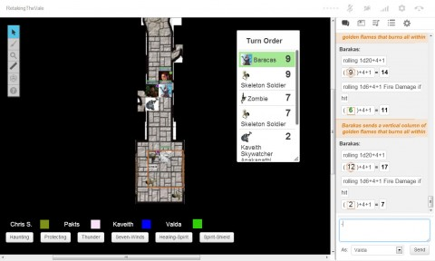
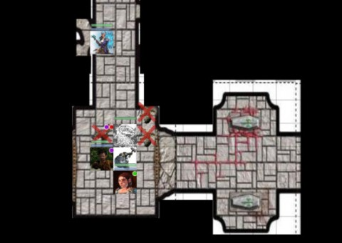

# D&D4e: Temporarily Alive

*Posted by Tipa on 2013-03-01 07:28:50*

[caption id="attachment\_10747" align="aligncenter" width="480"] Exploring a crypt with Roll20.net[/caption]

When there's undead behind you, undead ahead of you, undead below you and for all I know, undead above, you just have to wonder if maybe this "living" thing is just a mistake. A mistake the gods are trying to fix.

This is why Valda puts her faith and trust in good, solid stone. Stone that protects. Stone that builds. Stone which, when dropped from a good height, makes pretty short work of undead.

But there's no good stone in the forest. Just trees and undead. Undead swarming from beneath the mountains, swept along by a force emanating from Shadowfell. A sudden clearing; living survivors hurled together for one last stand. Not far away is a stone chapel.

The solid sanctity of well-fitted stone calls Valda like a siren. The others -- a [goliath](http://en.wikipedia.org/wiki/Goliath_(Dungeons_%26_Dragons)), a [tiefling](http://en.wikipedia.org/wiki/Tiefling) and a gnome -- see the chapel as well. They move together toward the sanctuary.

The door is locked and barred. The four refugees yell and shout and pound the door; the goliath takes up his hammer when the door opens a crack. There's a human looking warily through the barely opened door. The goliath pushes the door open, and the four pile in.

With the door locked and barred once more, the refugees catch their breath and introduce themselves to the humans barricaded inside this small chapel. Valda, stoneborn shaman. She calls the spirits of the stone to aid her; they coalesce into the form of a shimmering basilisk. The goliath, Kaveith, is a warden from a northern land. The gnome, Pakts, a warlock; and the tiefling, Baracas, a wizard. 

The humans are all that are left of a nearby village. Undead claimed most of them; the survivors took what supplies they had and barricaded themselves in the chapel. The simple benches were broken apart to cover the windows and bar the door.

The humans are not doing well. Their leader, Nathaniel, has an injured leg and cannot move swiftly. Teenaged Jass wants nothing to do with the four strangers; the other humans want the refugees gone, but it does look as if they know how to fight; if they are fleeing the undead, if they would take the human remnant with them, surely the gods would reward them?

There is no other exit from the chapel. Aside from a well-locked steel door in the back of the chapel, behind a tapestry. A search of scattered vestments reveals a set of keys, one of which opens the door. If there is a path to safety, the villagers are promised, we will return for you. Meanwhile, lock this door securely behind us.

A poorly carved tunnel leads into the ground. The goliath has to crouch in order to make his way. Valda instructs her basilisk, Dern, to stay close to the giant. Pakts and Barakas follow.

There are undead, but nothing too deadly. These are undead who will not be scheming a way into the chapel any longer. After sending a half dozen undead back to their graves, the party pauses for a brief rest in the well-constructed foyer to a mausoleum.

[caption id="attachment\_10748" align="aligncenter" width="480"] Still Alive![/caption]

We start on our new adventure! There were supposed to be six of us, but only four were able to make it. We did our best. The DM, Chris, threw some softball encounters at us as we figured out the rules and tried to do things the right way. Always something more to learn, with D&D.

The star of the night was the Roll20 tabletop software we use. The ability to tie our skills and spells to macros speeds combat quite a lot, and lets us players add a little bit of flavor text so that it's not just a dry announcement of an ability. The top picture shows Barakas sending in some death; you can check out my spell macros listed below the play window.

Roll20 keeps us relying upon our player handbooks, and that's a good thing. It feels like we're really playing D&D now, not just playing the tabletop software.

Still loving the automatic docking of Roll20 in to the Google+ Hangout.

Next week: a mausoleum! THAT doesn't sound dangerous! And, what's happening with the villagers we left behind?

