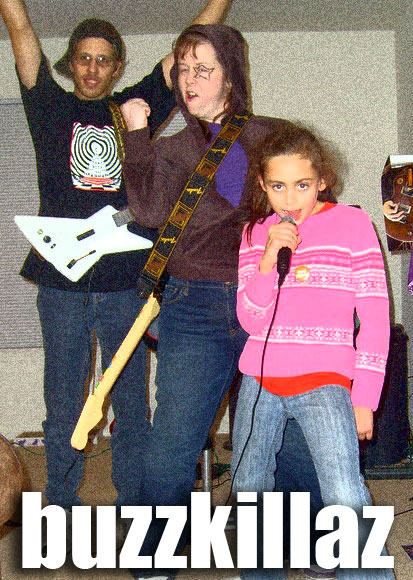

# Rock Band: We'll get medium on yo azz.

*Posted by Tipa on 2007-11-24 23:33:06*

Yeah, we're turning it up to ten and a half.

That's Drew on bass, Genj on lead guitar, Jazz on lead vocals and me, I'm the drummer. I look like Genj, but taller.

See, we had it easy. And by that I mean, we were cruising along where everyone was on "easy" (I was on vocals; I think I may have dared to stretch to "medium".)

And after awhile, we were getting no more fans. Too set in our ways. From city to city, always the same songs, hoping the van wouldn't break down...

So we took it up. To medium. Drew couldn't drum at medium, so we switched; but he couldn't sing, so he went back to bass and Genj sang, but it didn't work out so in the end, nine year old Jazz ended up the singer, me on drums with the aching ankle, Genj on lead and Drew on bass.

Worldwide fame followed!

But now... well, in Stockholm, they want a little more than we can give... so we're stuck... in medium...

