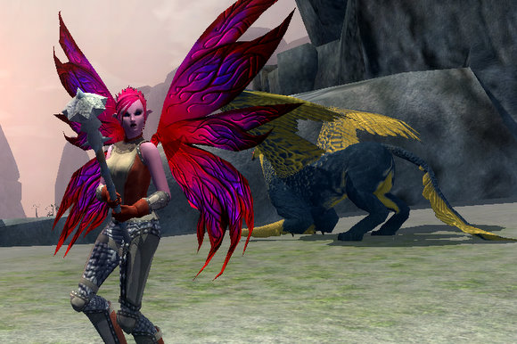
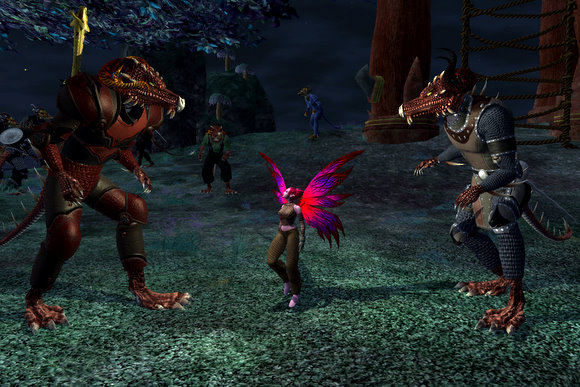
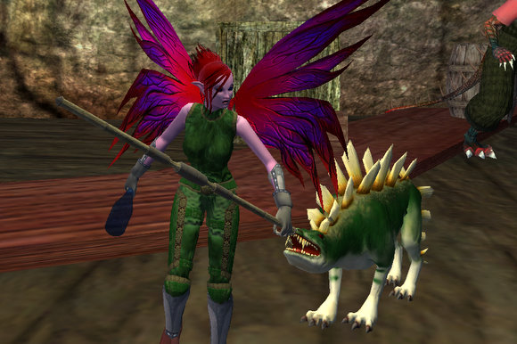
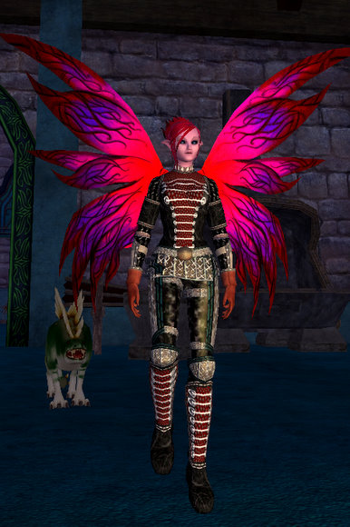

# EQ2: An Arasai in Timorous Deep

*Posted by Tipa on 2007-11-25 03:50:15*

During Beta, I [made some bruiser armor](../index.php/2007/11/12/eq2-tier-8-tailoring/) for an Arasai -- just to see how it looked. And I thought that Arasai looked so cute in it that I would save her character file and [make a level 1 copy](../index.php/2007/11/13/eq2-preparing-for-kunark/) of her on the live servers.

People were having so much fun in the expansion newbie grounds that I thought I'd take her over there -- thanks to Khek's patient directions, I managed to stumble onto those alien shores with only one death -- a death that brought me right to the Sarnak newbie quest-givers.

They didn't know WHAT to make of me. So confused were they, that they just assumed I was a particularly mutated Sarnak. Since they ARE a created race, nothing surprises them. Did you know Sarnak babies must be put into a special machine that teaches them how to live? Sarnak have no instincts -- they have to add them. They say if a baby is not immediately put into a machine when they're borb, they will die. I wonder if the machine even has to teach them how to breathe.

They don't know who, or what, created them. They don't want to worship their creator. They just want to know why. The aviaks that ceaselessly battle them may know some answers. And that's the Sarnak newbie experience. Trying to find out why things are as they are, why the Sarnak even exist and what might be their purpose... the lowest of the low, hated by all and yet still struggling to find their own place in the world. They are not bent on conquest, only survival.

As reported everywhere, the newbie quest rewards with the Sarnaks far exceed the usual run of equipment for a newbie. Even a whiskey bottle can be a deadly weapon, it turns out. You even get a fighting hippogriff pet -- as WELL as a Chokodai that will follow you around. He's a Chokemon. Collect them all!

The Sarnak lore drew me through the quest lines. Made me wonder whatever happened to Dalnir, the home of the Kly -- a sect of Sarnak -- and quite possibly a place with answers (and great monk gear!). Yet, Dalnir -- like Kaesora, Droga and other mid-level Kunark dungeons -- has disappeared, so these Sarnak may never know for sure.

I saw someone there with a white gi appearance armor. I want! It was level 6! I begged him to tell me where he got it -- he said he got it in a Neriak newbie quest. Neriak -- Darklight Woods? My home town! So I hurried back to Neriak and did the newbie quests up up through the Wanderlust Fair ones, but nope, no gi that I could find. I did find parts of the bard uniform, so what the heck, I have them as my appearance armor until I get high enough level to do and wear the armor quests. That's a gi look that can take me many levels.

Level 20 has never been easier, or as much fun, on a blue server (1-20 in Darklight Woods on the PvP Nagafen server as incredibly fun, though not as fast due to the hunters looking for tender young Freeps!)

