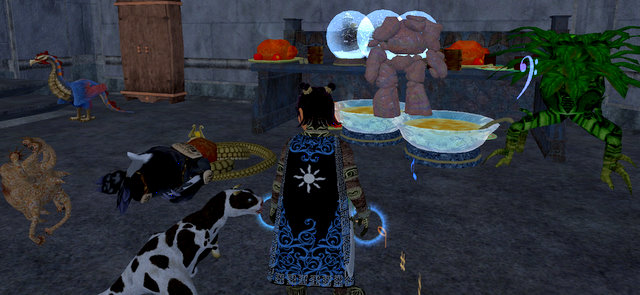

# EQ2: It's a jungle in here.

While traveling, I could only play for a little bit here and there, so I focused mainly on Frostfell crafting when I did play. I did get a group finally to finish my Bone-Clasped Girdle, and thanks to the new non-aggroness of the Sanctum of the Scaleborn, advanced a step in my Wurmslayer quest. Yes, I am way behind on quests, and it has been impossible to find groups to help.

Anyway. I crafted and crafted and made several full Frostfell dinners, bowls of eggnog, plates of cookies, numberless paper lanterns, wall sconces and candy canes and stuffed them into my little three-room flat in South Freeport, somehow... I stopped by last night to restock my shop, and found... this...

Dalnir, my Burynai, passed out, snout buried in the naga. Golem dancing in the 'nog. Daisy snaking a sly tendril out to grab a sip. Snow globes lurching crazily from one tune to the next. Drunkenness everywhere. Dogs and cats, living together....

I am so utterly, entirely, out of room for all my stuff. I would love to move to Gorowyn, but it is so off the beaten path; I love how Freeport is set out, I know my way around there so well. I don't like Neriak's rooms much, and Maj'dul is as out of the way as Gorowyn, nearly.

I might try Gorowyn, anyway... but I'll set my Recall point in Freeport.

I just worry what my pets will get up to if I'm not home more often. They already totally tear up the place when I'm gone.

Some progress. Last night was my first night back, and I was determined to make it productive, though I was a little delayed by doing my laundry and watching "A Raisin in the Sun" on Turner Classic Movies. (Sidney Portier ftw!) I have cleared nearly all non-heroic quests from my Kunzar Jungle quest log; I just have the Reet camp quests to finish, and then I'll be done, aside from all the quests that want me to return to the City of Mist.

Dina is a little more than 85% through level 78 (I got about 40% from quests last night), and now has 125 AAs. Dera dinged 76 (yay!) and 100 AAs (yayyay!), but isn't doing as well on the KJ quests; I'll end up coming back to do the ones she missed.

I have no idea whatsoever how I could solo these with any sort of efficiency. If I couldn't two-box... I doubt I'd be playing EQ2 anymore. Playing an MMO by myself is already pretty boring. Doing it badly would be infinitely worse.

