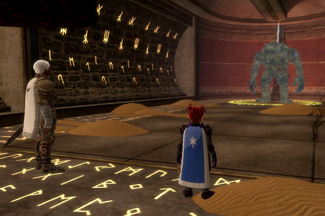
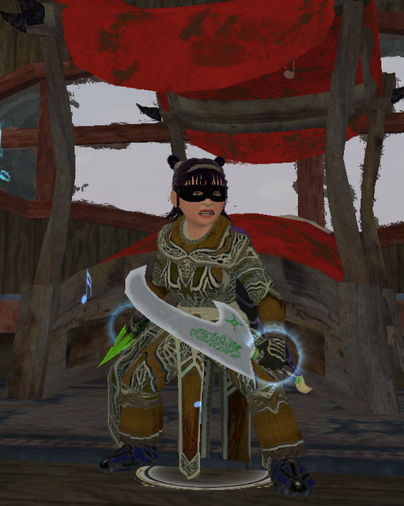
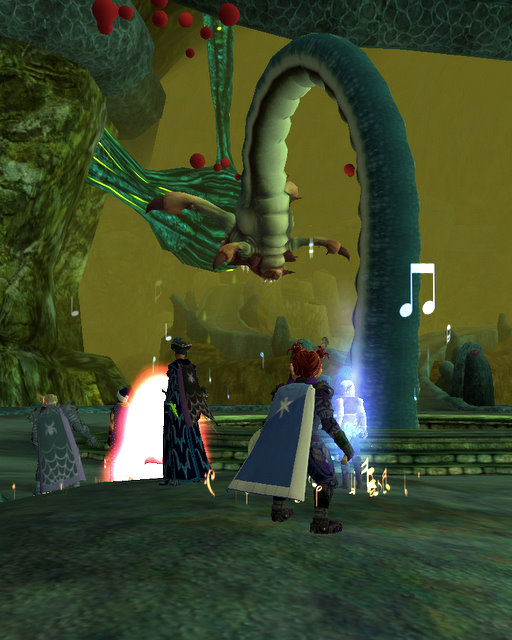

# EQ2: Here's what a good day looks like.

Saturday was an off-day for the guild, so I figured I'd get going with the whole crafting biz. I have to get Dorah, my jeweler, to 40,000 faction with her tradeskill society, *and* to level 80 jewelcraft so she can make Dina's spells. No problem, thinks I. I drag her to Gorowyn because there's no possible way I can find my way out of that confusing place (Mission: Find the mender in thirty minutes or left, starting... NOW!), grab some writs from Mister Hi I'm The Guy Who Stands Here Night And Day Just In Case You Came Buy, and set off, whistling merrily, Dina's mind wandering as she finds herself being Dorah's mana battery. Because, you know, bards = power song.

Thought nothing of it until Dorah noticed that her faction with the Coalition of Tradesfolk was mysteriously NOT RISING. Oh CRAP. When she moved to Neriak, her tradeskill society switched to Dark Bargainers.

She's going to have to move back to Freeport. Back to expensive housing Freeport. Because she needs that Coalition faction in order to make that AA-switching mirror. Sigh. She can have Dina's old place in West Freeport. West Freeport has EVERYTHING... bank, broker, crafting instance, city merchants... if you want to be in the most useful part of Freeport, and one room just isn't enough for all your STUFF, you can't beat West Freeport.

Anyway, I decided to take a break, and log Dera in to sell, repair, change outfits and stuff. I got sidetracked... I always get sidetracked... and found myself in Kunzar Jungle, questing and looking for an instance group (but not CoA, since I was locked out). After the fifth invite to a CoA group, finally someone was going to Maiden's. "A-ha!". I thought. "I can finish Anaphylaxis!".

That's the Jarsath Waste quest given by a little Fae outside the Vault of Eternal Sleep that results in a level 80 Legenday weapon, which is very nice for all classes (except Brawlers, apparently). You run through VoES, and then through Maiden's Chambers (the other Charasis instance, home of dirt, donuts and Drusella Sathir) (I was kidding about the donuts). The priest weapon is highly droolworthy. And the scout weapon looks like the old Rogue 1.5 epic from EQ1.

That's Sandstorm. He spits off tiny storms as you hurt him, but we had an enchanter and they couldn't do much but just stand around pining for the Sahara while we killed Mom. 

Oh yeah, Dera joined a guild around then. Someone sent me a tell asking me if I wanted to join an alt guild. I said, "Hey! I'm an alt!" and she said, "Great!" and then I was guilded. Go me! It's a wonderful day when even a 78 cleric can find a guild!

Don't do Maiden's without an enchanter. I mean, if you're in a group, and someone says, "Maidens?", and you look around and nobody has the kinda listless faroff dreamy enchanter look, just say no. I've been there twice without an enchanter and once with, and twice there was a lot of death and once we just stood around while stuff died. Enchanter GOOD.

Oh yeah, and take another look, and if there are no HALFLINGS in your group, well, you're just missing out. A lot of times in dungeons, you'll come across a pie-eating competition AND THEN WHAT? YOU'LL LOSE! Well anyway, it might happen.

We couldn't quite get the hang of killing Drusella.

The group wanted to go on to Chelsith, but guild wanted Dina for some instance fun and hey, count me in any time.

I'm not sure what instance it was. It I think it was Vault of Eternal Sleep, I know I was hoping we'd go there so I could get my green dagger. Kinda unusual my lower level alt would get her Anaphylaxis weapon before my main did. We may have done an instance before then but I know we did do VoES, totally smoothly. That place is so fun now. Got my updates, went to Maiden's without an enchanter (note to self: you are not an enchanter), managed to make our way to Drusella with some death but (significantly) hitting the Skorpikis guy up for his tail so Dina could get her dagger.

That's Dina with her knife and a new robe she got in Maiden's (she also has a new hat you can't see, the third piece of the legendary RoK Scout set, which gives her a nice double attack bonus for having three. She's standing in her bedroom in her Gorowyn suite. Ooooh, windows!).

I went off and repaired and was thinking about what it would take to get Dorah moved back when the guild needed a second healer for Chelsith, and was Dera perhaps available?

YOU BET!

Chelsith is a temple the Murlocs built to provide for the care and feeding of their giant, [multi-tentacled](http://en.wikipedia.org/wiki/Tentacle_sex) [hentai loving](http://en.wikipedia.org/wiki/Hentai) god, but for me, that place will always live in my memory as the home of the majestic Penisaurus, proudly displayed in the picture above. May it scar you as I was scarred. Brrr.

After a brief supper break, Evalin was on the prowl for a reflective shard with which to make a reflective AA-storing mirror, and I asked if I could bring Dera along for some xp and he said, sure, and the group picked up other lost strays until at the end of a few short hours, having found a shard, the group did what ALL RoK groups eventually do and went to the Crypt of Agony.

Every expansion has the one place you always go. DoF had Tables and the Hidden Cache. KoS had SoS and the Palace of the Awakened. EoF had Mistmoore Catacombs. And RoK has the Crypt of Agony. It's not "if" you go. It's "when". And "how often?". And "oh no, not again" :)

It's a fun, short crawl, lots of loot and the game's most annoying debuff, and hey, guess who dinged 79?

That's right, our (second) favorite halfing, Dera.

One short level to go and then I DON'T HAVE TO LEVEL ANY MORE!

This is my perfect MMO day. Solo questing or crafting until I get a group, and then, grouping and having a great time with friends new and old. It's what makes EverQuest, EverQuest.

Tonight's a raid night. So more on that later :)

And hey, if you've read this far, could you do me a favor? If it's before January 1, 2008, could you send my sister a [Happy Birthday](mailto:jennifernyc2003@hotmail.com)? Her birthday is New Year's Eve and nobody ever remembers :P

