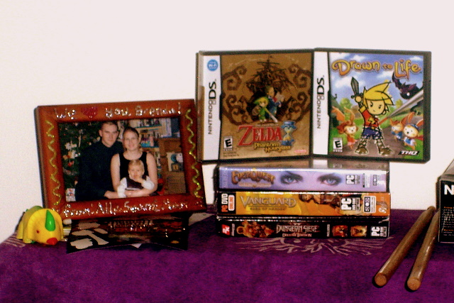
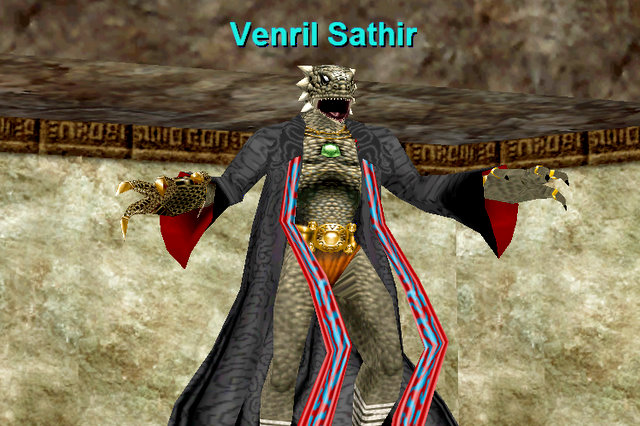

# Santa Came Late!

*Posted by Tipa on 2007-12-31 19:21:33*

Our local CompUSA is closing (well, they all are... but so is our local one!), so I went down there to scavenge today. 

And, oh look what Santa had for me at discount prices. Dungeon Siege 2 with the expansions. That DS game where you draw your character and lots of other stuff in the game. Zelda and the Phantom Hourglass. Oh, and Vanguard, and EverQuest with all the latest expansions.

There's something about that game.

I'm SO OVER IT. I really am.

*C'mon... you can solo me...*

Anyway. I've been talking to some friends on EQ1, and I dunno... eventually I might go back in some capacity. I only have one account on Station Pass now, and my rogue, Tipa, only has gear up to Gates of Discord. Brita, my cleric, at least has gear up through the Depths of Darkhollow, has about 900 AAs vs 455 AAs, and is level 75 (and is flagged through DoDH), so I'd have to transfer her from my inactive account ($$$) then find some time to actually play ($$$) and also the inevitable EQ LFG4EVR syndrome... well, EQ2 is my home. But now I can go back and visit.

I downloaded the new Station Launcher and it downloaded all of EQ1 up through Serpent's Spine (the last expansion I bought), logged in in KC (last time I logged into EQ1, was taking pics in KC), and there were *people* there -- an xp group at the front, and a high level group coming down to take Venril Sathir on (I dashed in for the picture before they got there... rogues don't have to clear the way).

A couple of old CE friends (hi, Egat and Banayd!) we on.

What all started this was a comment yesterday that someone should put me in their pocket. And I remembered an old Barbarian Warrior, Hagath, used to talk about putting me into his backpack.

I wonder what became of him? I started hunting down old EQ1 friends by /tell EQ.Erollisi.YourNameHere... and found Banayd pretty quick. He was good friends with Haggy. And he told me what had become of him, though not how to get in touch with him.

Anyway. It's easy to leave a game but very hard to leave friends. For friends, I can make a place, probably a very small place, for EverQuest.

