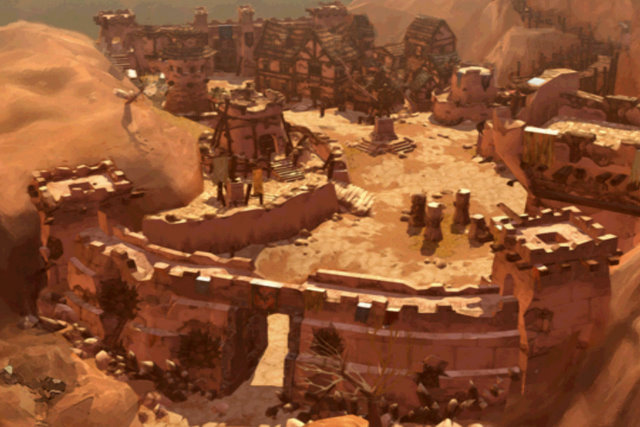
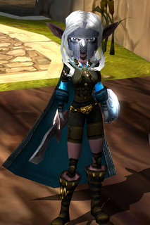

# Mythos Beta Invites

If you've been wanting to try Flagship Studios' Diablo II-like MMO Mythos and somehow have managed to avoid getting a beta key, well, your wait may be over. Flagship has given every beta tester two keys to give away, and I already had one so that's three old-school MMO fans who could be playing 

All I need is your email address -- so post a comment here, make sure you use a real email address in the field where you put it, I'll send the first three beta invites. Don't post your email address in the comment itself unless you like getting spam. Trust me, this blog gets harvested by spam bots several times a day (as do all web sites, I imagine).

**My apologies, but I only had three invites and I gave them away in a couple of hours. Last time I checked, Mythos hadn't given me any more. However, there are a couple of suggestions in the comments on how you might be able to get in touch with people who might still have some to give.**
