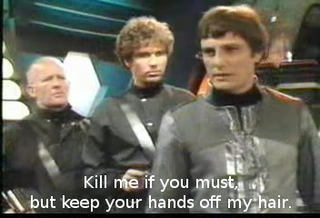
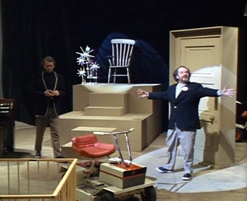

# SF MMOs we'd like to see...

When Wired ran a story headlined "[Apple Plotting an Avon Power Play](http://www.wired.com/gadgets/mac/commentary/cultofmac/2008/01/cultofmac_0109)", all I could think was, "Damn that Avon! Which side is he ON?". Of course, he's always on *his* side, but then I wondered why they mentioned [Blake's 7](http://en.wikipedia.org/wiki/Blake%27s_7) in a "Cult of Mac" article. 

Turned out they meant the cosmetics company. Ouch. When the Stargate MMO press release came out a few days later, I got wondering about when they were going to make MMOs on the SF series I watched when *I* was a kid. The blame for these rests, by the way, entirely on my father, who used to watch them on PBS when I was young. It's his fault I got into SF. My mom's to blame for giving me the Lord of the Rings boxed set on my 8th birthday. 

**Blake's 7**

`
`

In the future, most of the galaxy is in the grip of the Federation, a fascist state that brutally oppresses any planet they come across. Earth itself has become an Orwellian dystopia. Opposing them are the free planets, colonized by people who are fleeing the Federations expansion; lost colonies of people no longer quite human; and aliens who have their own ideas on who should be running the galaxy.

On his way to a prison planet, rebel leader Blake, with the help of his fellow prisoners, takes control of a Federation prisoner ship, and while evading Federation patrol ships, happens upon an alien starship they name the Liberator. His fellow prisoners, including the duplicitous Avon, spend the next three seasons trying to overthrow the Federation, which comes to an end three seasons later, when second in command Avon shoots Blake to death. Blake's 7 is possibly the only TV series ever in which the good guys lose.

How could this be made into an MMO? With its combination of adventures in space and on the planets, Blake's 7 would have the same challenges as a Star Trek MMO, except that person ownership of space ships actually has a place in the B7 universe and space battles tend to be fairly small scale, as when any ship is hit, it takes a long time to repair. In B7, all conflicts were *not* resolved at the end of each episode, and when someone got hurt or the ship got damaged, that had repercussions for quite some time. A main "evil" faction, the Federation; a "rebel" faction headed by Blake (just news that he was still alive was anough to keep the rebellion going), and any number of more-or-less interested non-Terran civilizations.

Full PvP? Alliances? Betrayals? And people with utterly fantastic hair? Count me in.

Here's a link to [some of Avon's best insults](http://youtube.com/watch?v=SWHLU8fwi80)...

**The Prisoner**

I'd be kind of surprised if SOE weren't already working on an MMO set in this Cold War-era spy series. Patrick McGoohan resigns from a British spy agency, and is then abducted and imprisoned in Wales in a place known only as "The Village", where every resident used to be a spy, and are known only by their numbers.

"I am the new Number Two." "Who is Number One?" "You... are Number Six."

If you try to unsubscribe from "The Agency" -- this is where you go. Life can be easy, if you cooperate.

How to make this into an MMO? How about if every player has a secret they must not reveal; and their status is based on how many secrets can they learn from others?

And when you finally get enough secrets and escape from The Village, next time you log in, you're back where you started.

I have always loved the complexity of British science fiction. Make no mistake, The Prisoner is science fiction. It constantly explores the notions of identity and free will. Nobody is what they seem -- a notion more true in The Prisoner than it ever was on Babylon 5. Nobody. Not Number 6. Not Number 2. Not Number 1. Not even The Village. And the best part is, they never give you an answer. There are no answers.

While Americans were watching Star Trek, Brits got the Prisoner. I'm not sure who got the better deal.

**UFO**

UFO was Gerry Anderson's followup to his puppet SF show, "Thunderbirds". This one, thankfully, did away with the puppets. Whether the acting was any less wooden is best left to the critics.

Unlike Thunderbirds, which used super science vehicles and weapons to combat a variety of threats, in UFO, they had just one enemy: the aliens secretly attacking the Earth. Abducting people into their dark water filled spaceships. Commanded from SHADO -- Supreme Headquarters Alien Defence Organization, fronted in a London office building in distant 1980, the forces of the undersea ships and planes, the land crawlers, the watchful orbiting space platforms and the purple-haired women of Moonbase (watch the intro above).

Think of this as Tabula Rasa, BEFORE the Bane destroyed the Earth. What if we could fight them off? I don't know particularly why they had to be so secretive about it; back in the 60s and 70s, you couldn't have a SF show without a bunch of secret agencies. They were just in love with them. Their rationale was that as long as nobody knew Earth was fighting back, the UFO aliens wouldn't attack Earth in force. Kind of a bad bet in my opinion; hoping they wouldn't attack openly. If they ever decided to do so ANYWAY, well, we wouldn't be ready!

The show was a little silly. But it would make a GREAT MMO.

You would be in the command of a certain specialized vehicle, depending upon which organization you belonged to. Missions would lead you to various alien incursions. As you gained in strength, you would upgrade your vehicle and move ever closer to the center of the alien invasion -- and someday free Earth forever.

Like most British SF, you never know what you're fighting or what their motives are. Those things, you don't get to know, but you have to make a decision anyway and hope you don't make things worse. This sort of fatalistic approach to life must have something to do with the British psyche and is in stark contrast to American optimism.

**American SF shows**

Americans were no slouches for SF in the same period. Aside from Star Trek and Irwin Allen's Lost in Space, there was Irwin Allen's Time Tunnel, Irwin Allen's Land of the Giants, Irwin Allen's Voyage to the Bottom of the Sea and... man, that guy was everywhere. The Invaders, The Immortal, Get S.M.A.R.T., I Spy, the Man from U.N.C.L.E. (see what I mean about acronyms?). But a common failing of them all (except perhaps The Immortal) was their episodic nature. In these shows, everything was all better at the end of the day.

My favorite of all of them was "It's About Time", an incredibly obscure series about a couple of Gemini astronauts who accidentally orbit the Earth fast enough that they go back in time and take caveman wives. Yeah, I sang that theme song ALL THE TIME.

Annoying brat, me.

Growing up in the sixties > whatever age you grew up in, unless you grew up in the 60s too in which case, hi! And if you grew up in the 60s in Britain, well... LUCKY!

