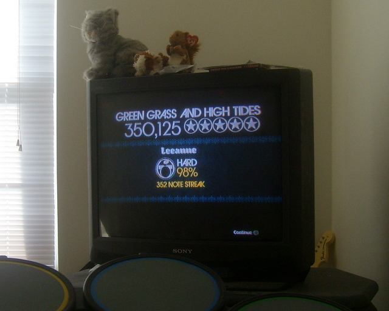

# Rock Band: Drums R Hard

*Posted by Tipa on 2008-01-13 11:17:49*

Yeah, i know the song isn't THAT hard, and Stone Temple Pilots' "Vasoline" in the same set was a lot harder, and this is mostly an endurance test with only a couple of "gotchas", but still, this beats my previous solo score on this song by over a hundred thousand points and so... now that I'm going into the Berlin set list with some truly tricky songs therein, thought I'd mark my accomplishment :) I'm learning how to play these things! On Hard!

*Later: Oh, forgot to mention the thing I really wanted to mention. STP's "Vasoline" was impossible for me until I calibrated the game. I thought I didn't need to, since I don't have a HD TV (just an old CRT one about ten years old), but, apparently, I did. Calibrated it and nailed the song the very next try.*

