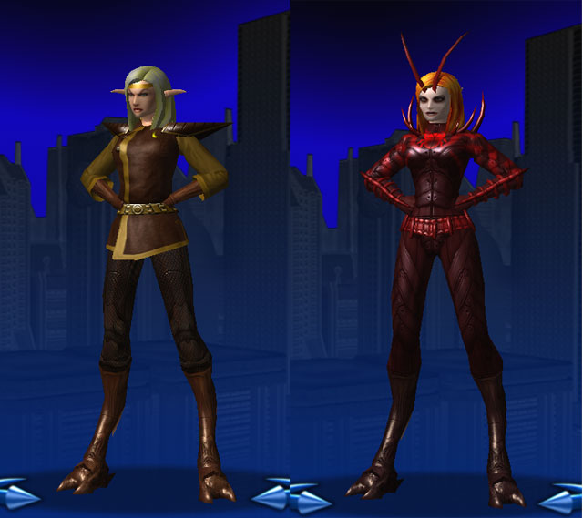

# CoV: The Rebirth of Madame Scurry

*Posted by Tipa on 2008-01-15 09:14:44*

A couple of friends from EQ1 play casually on City of Heroes. They still play on EQ1; I moved to EQ2, but I miss playing with them. Turns out they occasionally play on City of Heroes, although, unfortunately, not on my server (Virtue). So I remade my "main" on Virtue, Madame Scurry, to play with them on Liberty.

I hadn't been happy with Madame Scurry's old look. Basically, well... she looked too *nice*, and not much like the cockroach from which she gets her powers of stealth and regeneration. And plus, c'mon... the original Madame Scurry looks more like a hero than a villain.

I'm all about the villains... so I took the opportunity of restarting to completely redesign the character.

First, her costume is far more chitinous. Antennae, of course... that should have been in the first one. A more interesting face, and a nicer looking hair color. All sorts of sharp things. I was trying to make v1's shoulders look like beetle shell but that just didn't work.

Now... she looks villainous.

Carlisle and Binxs had been powerleveling me, but that left me very low on enhancements, since many times they'd complete my missions before I even got to them. I've been doing a little soloing for more.

I've been reconsidering the whole Stalker class, anyway. I always seem to play stealth classes, or healers, in every game. It might be time to knock over the apple cart and try something new, like a tank or a blaster... Even a mastermind.
