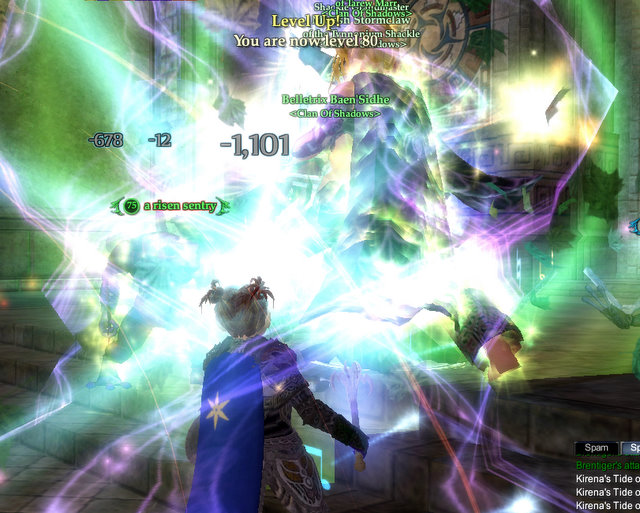
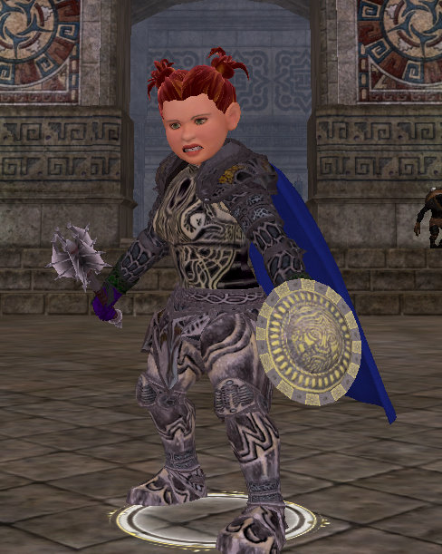

# EQ2: Dera loves Jackson Pollock SO MUCH, she wears him.

*Posted by Tipa on 2008-01-19 12:28:16*

When you ding in EQ2, everyone knows. When you ding 80, there's an explosion of light and a legion of angels fly down from Heaven calling your name.

"Dera! Dera! Dera!" they sang.

I'd been carrying around so much level 80 stuff I could finally use. That Mace of Loving Skullbashery from the Anaphylaxis quest, for one. A nice necklace for another. None of the armor I wear is much good for healers, because SOE knows healers only wear leather.

People who just want to kick butt and cause pain wear PLATE. Fluffy HEALERS wear dead cowskin. Badass KILLERS wear plate.

Damn right. Inquisitors are a DPS class and now everyone knows.

But what is UP with that armor design? It's like a blind person who'd never held a paintbrush tried to paint an incredibly detailed, monochrome rendering of a Candyland board on my armor.

I went back to New Rivervale and put on my Tier 3 quest armor until I find something that looks as bad as me. I also went on a spending spree, getting most of my Adept 3 spells. This will allow me to cause MORE PAIN.

Damn right.

And not bad for leveling entirely in groups... It took a really long time to get these last two levels, but having to level keeps giving reasons to play. Now she just needs 35 or so AA points... which means, back to questing.

