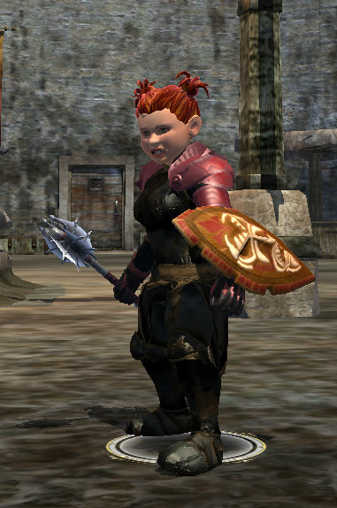

# EQ2 (et al): Random Bits

 Kind of a mishmash post today. I start out with some EQ2, then move on to TV and lastly a little bit about work right at the end.

Being a recruit in a highly successful raid guild going through Veeshan's Peak for the first time leaves me plenty of time to play alts and watch TV shows :) The night before last, I worked a couple more levels with Winterwing, my Arasai bruiser who is bringing the fear to Butcherblock and about whom I'll write later. Last night, I played Dera, whom I hadn't played much since she reached 80 over the weekend.

Those 35 AAs won't earn themselves. And I don't see any inquisitor masters in the mailbox, so there's work to be done here. You can see from the picture that I've decided the look I used for her when we first got the appearance slots turned out to be exactly the look I needed all along, and so that horrid swirly hypnotic gag-inducing RoK armor is safely hidden, and you may look directly at the halfling once more.

The Crypt of Agony was the first dungeon of the evening. I'd just finished getting the last two Adept 3s for my class -- Ministration, my fast heal (thought I'd done my heals FIRST, but not this one), and Tenacity, my stamina/dps buff. Tenacity... hey, didn't I cast that waaaaay back in EQ1? Yes, I did. In fact, I could MGB it -- cast it on everyone in the area all at once.

When will EQ2 stop slavishly copying from EQ1.... Sheesh.... the name doesn't even make sense unless you know it was part of a spell line that included Virtue and Conviction. Here in EQ2, it's just dropped in with no history.

I met up with Glokk in the group -- I used to be in Revolution with him, and he used to blog as Quylein the Mage. And probably still gets more traffic to his blog than I do :) He asked me near the end if I knew he was Quylein, and I sat there stunned... did he think I had been pretending to know him all night (and other nights when we chatted without necessarily grouping) because I was being polite but actually had no idea who he was?

I mean, that is something I will do (hi, Bremia)... but not in this case... (Bremia, I know who you are now. But sometimes I wonder if YOU do.)

Anyway, CoA went swimmingly; I got the Tiki healer shield (holding it... doesn't it look awesome? The face is sculpted -- you can tear someone up pretty bad with that nose).

That wasn't going to last. Next up was Vault of the Eternal Sleeper. They were going to go hardcore. Just me solo healing, no mezzer, nobody who could root, level 77 tank who'd never been before. But what, the heck. We ROCKED. We cleared that place MERCILESSLY. We wiped NINE TIMES. Only one of the previous three statements is true, by the way. Can you guess which one?

I don't know if it would have gone any better if I had been heal specced. I truly and honestly believe Inquisitors need to be melee specced to unlock the power of the class -- otherwise they are just wannabe Templars. I just don't think anything could have saved the group with that collection of classes.

A halfling dirge who came to replace someone who cut and run was a gas, though. I was in dark elf form, just for fun, and when he zoned in and I saw he was a halfling, I said what any good citizen of Freeport says upon meeting one of the shrub elves -- "Ah, a Halfling. Brell's most imperfect creation." Well, actually it's the gnomes who say that, but I thought he would get a kick out of a little roleplaying.

Little did I know he was very hurt by the comment. How was I to know he was, in real life, a halfling and really worshiped Brell and took offense at the notion that Brell wouldn't love him. Or something. I sent him a tell and explained that it was a joke, a little RP, and that's what a halfling might hear on the streets of Freeport. "*I*," he huffed, "am a citizen of MAJ'DUL.".

Yeah. Good luck with that.

---

James Bernandelli over at Reelviews.net noted recently that he's watching [a lot less television](http://www.reelviews.net/reelthoughts.html). Perhaps because the writer's strike has effectively weaned America from television, but mostly because, like me, he doesn't channel surf looking for more TV to watch. He just watches specific shows. And since he has a Tivo, mostly he records them and never does get around to watching them.

This is one of the downsides of our modern life. Not enough time for television. Too many other things to do. I never saw that Terminator show (though from guild chat last night, I needn't bother looking it up). And I just discovered [Jericho](http://en.wikipedia.org/wiki/Jericho_(TV_series)).

I'd heard the name before, but had absolutely no idea what it was about. Just this weekend, a blurb on io9 told that it was a show about the survivors of a nuclear war and trying to stay alive and sane in the small Colorado town of Jericho while the nation struggled to rebuild -- sort of a "[Testament](http://en.wikipedia.org/wiki/Testament_%28film%29)" meets "[The Postman](http://en.wikipedia.org/wiki/The_Postman_%28film%29)" without as much suck.

Now if I had channel surfed onto it last year, I would have watched it. As it is, I never even heard of it. I immediately begged the Internet to deliver unto me the pilot episode, and I watched it. Good stuff.

Because I've been a bad person, I haven't been keeping up with Goong, so last night I finally got to Episode 3. The seeds for Yul's strategy to get himself installed as Crown Prince are being sown as Chiang and Shin finally tie the knot and Chiang gets elevated to royalty. Her friends think she's abandoned them, though -- and perhaps there's the first small glimmer that Shin may feel something for Chiang?

---

Drew and I saw Cloverfield over the weekend, the movie that does for [kaiju](http://en.wikipedia.org/wiki/Kaiju) films what "[The Blair Witch Project](http://en.wikipedia.org/wiki/Blair_witch)" did for horror films -- put you into the movie via the handheld camera. Go see it. io9 (how did I ever follow SF before they started? Well, aside from religiously reading everything Cory Doctorow pointed out on Boing Boing, I guess I did not.) points out that the last scene, a tape of Rob and Beth's day at Coney Island, shows a Japanese satellite smashing into New York harbor, over there at the edge. Ah, now we know what woke it.

I'm always a big fan of underwater nuclear tests. Traditionalist, you know.

---

And if you've read this far, you're probably related to me, and so you won't care that I am finally getting to use Perl on a real project at work :) I've never had a chance to really get my hands filthy with Perl before now, and I think I might just become a fan of the language. It just does what you WANT in a way I have never experienced before in a computer language, not even my long-time fave lang, Python. That built-in regular expression stuff is a monster all by itself. I am seeing why people swear by it so much.

It hasn't replaced Python in my heart. But I'll save a spot for it.

