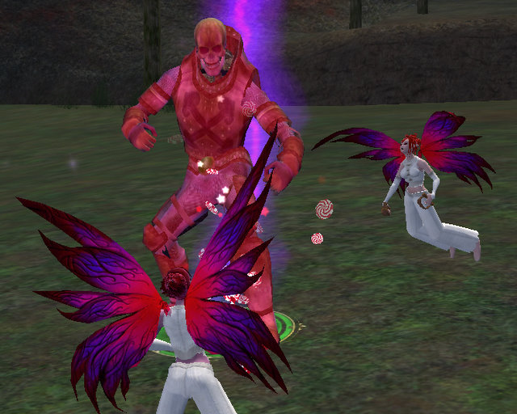
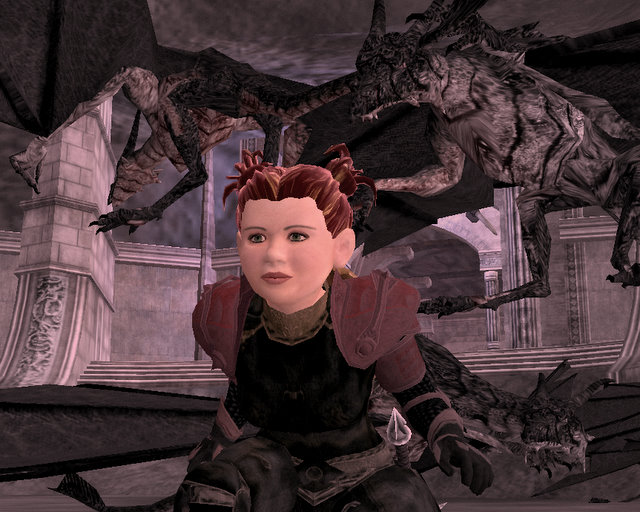
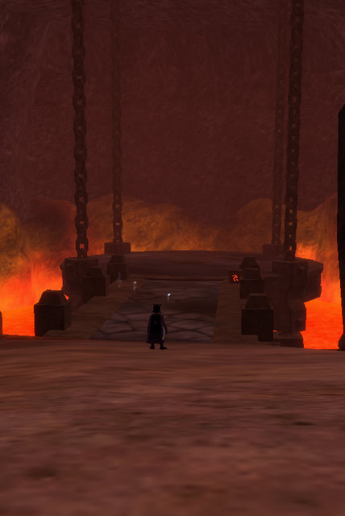

# Weekend Gaming: Of Veeshan's Peak, Twins, and Things that Go Bump in the Night

Well, if you insist upon knowing the truth, I spent the weekend learning to twirl drumsticks. Yes, really. Poring over Youtube videos, dropping sticks onto cats, sending them helicoptering across the room. I can do it, though. I can twirl drumsticks the standard (what some call, boring) way. There's variations so you can do little quick twirls while playing that I have to work on now. And of course, the double twirl is still beyond me. Someday, maybe years from now, it will be as important to know, RIGHT THEN, how to twirl drumsticks, as it was when I taught myself the one-handed card shuffle. Well, actually, that STILL hasn't really been all that useful (which reminds me: must practice one-handed card shuffle.)

A friend from EQ1, who now plays on WoW, started a new character on my EQ2 server (dizzying, isn't it.) I met up with her and OMG TWINSSSSSS! Well, I had to quickly do the quest for that spotless white gi so we could be even MORE alike. We tore through Darklight Woods, pulling hundreds of undead in all their throngs until the stupid, lazy named finally showed.

My insatiable hunger for dps had me spending most of the weekend in Solusek's Eye, trying out different AA and weapon selections. The answers were surprising to me -- turns out if you spec correctly, sword and shield is very viable for troubadors, and with my current choice of weapons, and respeccing for maximum benefit to shield arts, was able to get my tanking dps (so attacking mostly from the front) from about 990 to about 1150. Unfortunately, that's not a spec I can use on raids.

Dera's wondering if she heard a noise...

I was testing out Dera's dps, and heard over channel someone asking for a healer for the Halls of Fate. It had been forever since I'd been there, so I volunteered. There was a time I would never have been able to solo heal the place... but it wasn't a problem now. I guess all those levels help. All that RoK +healing jewelry doesn't hurt, either.

Someone was working on a quest that in the end, turned everything left alive in HoF non-aggro. So I hatched all the drake eggs and took some screenshots with my new friends :)

And later on, I soloed the second floor of Veeshan's Peak :P

