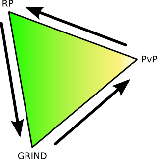

# RP, Grind and WTFPWN -- the MMO triangle

*Posted by Tipa on 2008-01-29 08:30:03*

Openedge1 over at [Simple and Complex](http://simple-n-complex.blogspot.com/) was listing off a bunch of upcoming MMOs and he noticed that there's been a sea-change in the MMO world; games are shifting toward a PvP focus, for better or worse.

Made sense; there's a cycle going on here. MMOs have their roots in MUDs -- Multi User Dungeons, largely text based and most definitely deep wells of roleplaying. But you could take RP only so far, and so they made them more gamey. Since the barriers to entry were so low -- you could bring up a new MUD all by yourself in an evening and then do whatever you liked with it -- a hundred different styles of MUD were written.

One of them, a level based MUD with monsters and classes, called Diku, evolved into EverQuest. When it started, RP was fairly important, and grinding levels wasn't that important at all. There was really nothing gained by being level 50; all that bought you was a spot in the waiting list for the Ghoul Lord in Lower Guk.

Ultima Online preceded EQ by a year or so. That game came from a different philosophy. The world was a harsh place. There was full on PvP, so leaving town left you at the mercy of roving player death squads. Somehow, RPers were able to get by, until they opened the non-PvP shard and nearly everyone moved there, leaving the PvPers nobody to kill but themselves. Which, if you're a PvPer, is pretty dull. PvPers want prey, not competition.

This recent shift in MMO development in order to escape the behemoth that dominates Grind inspired me to come up with the MMO TRIANGLE, that tracks shifts in games.

UO would start about a third of the way from PvP toward RP. Over time, it shifted more toward RP. EQ would start about halfway between RP and GRIND, moving toward the GRIND vertex. WoW started very near GRIND on the RP-GRIND segment, swung around the corner, and is now lumbering toward PvP, driving newer games like Fury, Age of Conan, Pirates of the Burning Sea and Warhammer in front of it.

Now, this triangle has an interior. A game on the GRIND-PVP segment could bend a little toward the RP side. It's not an absolute rule. 

What does this mean for the future? 

Well, if this has any truth to it at all, it means I only have to wait a couple of years for MMOs to round the PvP corner and start heading back to RP -- but with PvP as a major component. This means -- User Generated Content. Bringing us back finally to the beginning in MUDs, where we have our worlds, and you can visit mine and I'll visit yours and we'll meet up and go play in this big commercial one. 

Second Life is planted at the RP vertex. And let's place Warhammer squarely on the PvP vertex, though I think it is still a fair ways toward GRIND. So think of the future as being something like Warhammer, but with your own castles, battlegrounds, war machines and what have you.

That'd be pretty cool, right?

And that's what we're going to get, as soon as the industry finishes getting rid of the GRIND.

(cool diagram made with Inkscape.)

