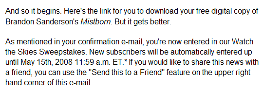

# Watch the Skies: Free books from Tor

I signed up a couple of weeks ago for Tor's "Watch the Skies" promotion, where they send you a dozen of their books, once a week, in PDF format. I'm always on the look for more books to put on my Sony Reader, but PDF files are usually formatted to a much larger page than on the Reader, and this was no exception -- the text, even zoomed, was unreadable to these old eyes. It displays well on my faithful Linux box, Baphomet, in fact very well.

The first book is *Mistborn*, by Brandon Sanderson.

I don't often trust fantasy books that come with detailed maps. I don't really care where your continents are, or what the street layout of your city is, or whether there are sufficient parks per square furlong. I guess it's nice you went to all that trouble to draw it, it must have taken quite a long time, but unless your book is about young Penwise the plucky map-maker, I really don't care. I'm never going to turn back to it trying to follow the main characters as they turn right at the corner of Potter's Way and the Boulevard of Tears and head south to the Executioner's Plaza.

Just tell me. It'll be okay. Don't need a map. Just cuz Tolkein did it doesn't mean you have to.

What I am looking for in a book are words, sentences, paragraphs of startling ingenuity and creativity. Just bring me somewhere I've never been and I'll be a fan forever.

Aside from the map, the book itself in its first dozen pages looks fun, reminds me of Asprin's old *Thieves World* anthologies.

More news about that later. I am still finishing up China Mielville's "Perdido Street Station". I don't know why that book is taking me so long to finish. It must be huge in real life. But there are still some sympathetic main characters who aren't dead yet. I hope enough of them survive to kill off the slake moths. When last I left them, they were about to spring upon the brooding matriarch of the moths.

