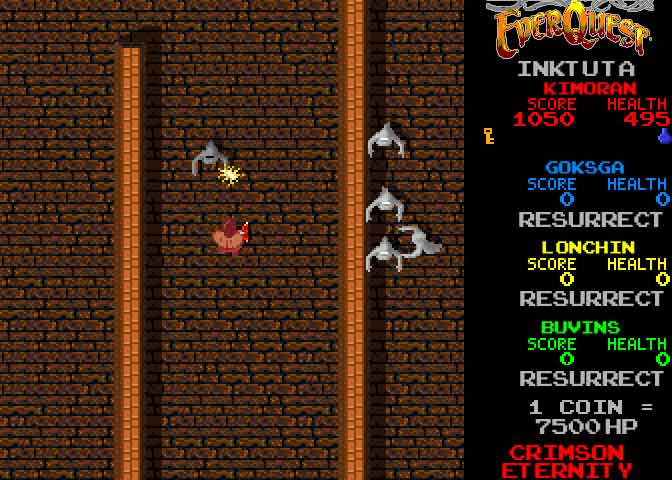

# EQ1: Pics from pre-Alpha

EQ1 wasn't always the raiding powerhouse game it is today. In fact, the game had very humble roots, with little in its first implementation to suggest the game it would become.

Still, it was fun and even at the beginning, was totally addicting.

Screenshots after the jump.

So shoot me :P

Just came across it while looking for old raid screenshots for another article. I made this when I was bored one day and didn't feel like posting yet another screenshot of us dying to grubs in Inktu'ta...

