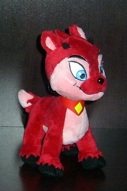

# Oh no, not SHAPESHIFTER again...

*Posted by Tipa on 2008-03-04 09:08:45*

Yeah, I'm back on Shapeshifter again, that amazingly difficult puzzle game on Neopets.

I've been thinking about getting back in that race again. I burned out on the puzzle back in September, but I have been getting encouraging notes from people urging me not to give up. There's a strange community of solvers out there. People get up to about 25 on their own, then get stumped and either give up or try to write a solver.

Anyway, I somehow acquired a mentor who is going to give me encouragement and algorithmic help on my road to level 100. I've just done levels 80 and 81 without any significant code changes, though I did download the Python-C compiler onto my dual core machine so I could pump up the performance of my current, Python-based solver.

Now I want to translate it all into Java and multithread it, see what happens there...

It's still a long distance to 100.

