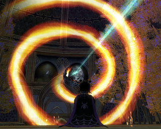

# The next EQ2 expansion is...?

*Posted by Tipa on 2008-03-13 15:33:31*

  
*Image of Luclin in New Tunaria*

The SOE summit is over, the Community Influencers have been told what the next EQ2 expansion is, shown the concept art, and they're ready to influence us, but they can't tell us... yet...

The news that Rise of Kunark would be EQ2's fourth expansion came out about a year ago next month, so we're just weeks away from finding out where we will be playing next fall.

My guess? The Shattered Moon. There are lots of reasons why we might return to Luclin. People have been claiming the moon's pieces are drifting closer together. There is an image of the moon in the New Tunaria throne room, and it is part of the orrery in the Tower of Moon in Maj'Dul. It is possible the Sleeper, Kerafrym, fled there when he was woken and perhaps was the cause the moon blowed up. It's a fantastically ominous place of mystery, and who wouldn't want to know what's going on up there?

If we're still tracking EQ1 expansions, then the next in line would be the frozen continent of Velious. Frankly, I'm not looking forward to recycled content from old expansions, but there were lots of reasons to remember it. It had more raid content than you could shake a stick at, plus many of the more memorable (phew! sorry) experience zones in the game. It was the expansion that really tipped EQ into the hardcore area; after Velious, there was a real pressure to hit max level that hadn't existed before. Three warring factions meant there was always someone to piss off; fantastic and innovative loot always left you one more thing to get.

If the plan is to continue filling in the old world, well, there's always Odus. We know it's still around; the monks on the Isle of Mara talk about the pirates of Gunthak, and they are even here and there on the island itself. I can easily imagine Odus would have been an adventure pack if they were still doing adventure packs. It had a good city (Erudin), an evil city (Paineel), one of the best dungeons in the game (The Hole) that included a never-implemented portal to the Plane of Underfoot at the bottom; the whole of the EQ1 Legacy of Ykesha expansion; the Warrens -- the best low level dungeon in EQ1, bar none -- and it would be the perfect lead in to a Luclin expansion, given its lore.

Or perhaps they could re-open the planes. I wouldn't care for that. EQ2 should never become a game only enjoyed by raiders, and that's essentially what PoP was -- only enjoyed by raiders. EQ1 eventually developed a strong pickup raid community that could do the necessary keying fights, but if you just wanted to get to the two best xp zones in PoP -- the Planes of Earth and Fire -- then you had to raid.

Those are my guesses. Part of me wants to be surprised -- and not the "omg they did Gates of Discord!" kind of surprise, either -- nicely surprised.

Any expansion ideas I forgot to list?

