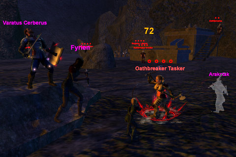
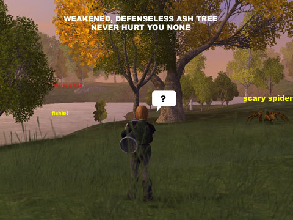

# VG: My first group -- Khegor's End

*Posted by Tipa on 2008-03-16 19:47:55*

Armed with a map that was at least semi-useful, I set out in Telon to get some levels, some loot, and some amazing screenshots.

Meh. I got two of the three.

My quest log is stuffed to overflowing with quests for Veskal's Exchange... I *really* need to get back there and do some of them before all the quests go gray on me. Fate wanted me near Tursh, though. [Satia](http://mmoquests.com) guided me to a harvesting trainer, and so I was taught the mysteries of ... felling weakened ash trees and looting logs from its corpse.

I was engaging in a little mini game called "wru weak trees and metal nodes???" when I saw a call for more for Khegor's End. Now I'd been wanting to head there since I first heard about it last weekend; I sent the tell, got the group, and we met up by the dam where the cleric shared all the quests for which a lowly 13 bard was eligible.

Off we went!

We'd been in the dungeon almost an hour when the first comment came about me needing pretty much everything that I could wear. It was true! I had to admit to them that this was my first character and that I had only been playing a week... and that this was my first group, besides!

They didn't say anything, but the talk of what they'd been doing all weekend on their mains kinda tapered off a bit. I guess I had this hope that I wouldn't be the only new player in the group, but nope, I was the only main in a group of alts.

Still was a lot of fun, and I DID need the upgrades and got them, finished a bunch of quests and came out of it two levels richer. Finishing up the dwarven quests -- the ones I could do alone, anyway -- was easy.

Next weekend? Back to Veskal's Exchange!

