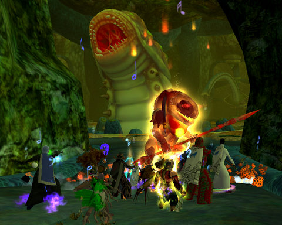
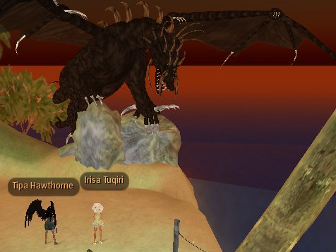

# EQ2: Leviathan 2.0

One of the dubious advantages of moving from one guild to another is learning new ways of defeating old encounters. Delusions of Grandeur kills Venril Sathir and the Overking in entirely different ways than did Clan of Shadows, and I had to suppress my urge to shout "you're DOING it wrong!" because, hey, DoG gets results.

So I shouldn't have been all that shocked when we got to Leviathan, the Tier 3 raid that is the gateway to Veeshan's Peak, and the leaders decided on something different than the slow range game that CoS did while I was with them.

Our way will take some preparation. We're going to farm fifty explosive vials, and kill him from the inside out in five minutes. But first, we have to farm those vials, which involves being swallowed and killing mobs in his tummy who drop them. Last night we did the farming. Tonight, hopefully, the 'sploding.

With any luck, we'll be seeing dead Leviathan in chunks all over the place... and we troubadours will get the second update for our mythical epics.

Speaking of CoS, I met (of all people) their most awesome dirge, Allegro, in Second Life! She invited me to tour an absolutely incredible space station -- I wish I could show pictures of it, but apparently the owners don't want anyone to know about it or to take pictures... it was really fantastic, though. Here we are a little later at a beach resort with a dragon theme, me in my Angel of Death outfit, she in her Easter outfit, chatting about the dragons of Veeshan's Peak :)

