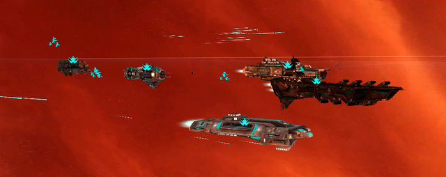
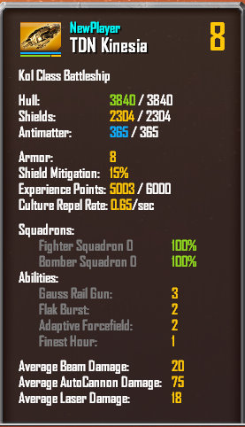

# Sins of a Solar Empire

I just want to start right out with a warning: *Sins of a Solar Empire* and *sleep* are incompatible. You can have one or the other; not both.

Sins is three games rolled into a yummy package. It's a [4X](http://en.wikipedia.org/wiki/4X) game (eXplore, eXpand, eXploit and eXterminate) where you start out in control of a single planet and grow until the galaxy is yours. It's an RTS in that you have to mine resources and increase your population. And it's a standard level-based RPG, with tanks, healers and mages and stuff.

You don't see that very often in a RTS, but it is all part of the *Sins* mix. I'll explain.

You start the game barely able to control your own planet, much less others, and there's always the threat of pirate attack even from very near the start of the game. And yet you must expand. Your tech tree is limited by the number of research stations and labs you can build, and each planet can usually have a very few of these, so unless you immediately start scouting the surrounding systems, you will be too weak to fend off any attacks.

Because you will never, ever win until you begin making capital ships.

If you think of capital ships -- the big battleships, liners, carriers and dreadnoughts -- as an MMO group, you'll be on your way to victory in Sins. You have your tank, a ship with massive shields and a heavy punch. You have your warlock, who hits enemy fleets with AE dots. You have your mage with missile-battery pets, your healer that fixes shields and repairs damage, your debuffer that stips enemy shields... Each of these ships can field squadrons of fighting craft and you quickly come to understand that the game is all about building a fleet of capital ships and support craft (cruisers that have their own flotilla of fighters and bombers and others that help keep the group alive), tracking the enemy back to their home planets and making them cry.

Best thing is, the capital ships level up. There's nothing quite like seeing a two kilometer long battleship ding in the middle of a battle. Since capital ships are the only ships that level up, you can see that one of your first actions in Sins is to make your tank battlecruiser so you can start leveling up the shields.

You must also quickly stamp out the spread of alien culture within your empire; if all the ensigns are wearing Nikes and rocking to their iPods, you've already lost your planets, your ships and the entire war without a shot being fired.

So some tips after a sleepless play of the game: Battleship as soon as possible. Your tank needs shields and experience to beat back the Nike-wearing, iPod-listening crowds. Fully exploit any planet you come across -- search it for alien tech, make it as livable as you can. Learn to pull. I TOLD you this was an RPG, right? When the enemy attacks, they will coyly stay at system's edge and bombard your planet out of range of your defense platforms. Go get them and bring them back to your fleet, safely within range of your defense and repair platforms (this probably won't work against human opponents... if you can find any that are looking forward to a ten hour game...). Focus fire works quite well; your fighter and bomber squadrons will keep the rest of the enemy in the fight while you take care of the larger ships. Use cheap scout ships to keep track of enemy movements. Discovering the hidden pirate base is a good thing, but don't attack it. Instead, generously cede the planets a jump away to the enemy. They will be so busy fending off pirate attacks that they won't have a chance to worry about you. The pirates can be your friends...!

*Portal* was my game of the year last year. *Sins of a Solar Empire* is well on its way to taking that title for 2008. It's cheap, it's from an indie game studio, and any reader of this blog will instantly "get" the RPG strategies for fleet building and deployment.

This is a triumph :)

