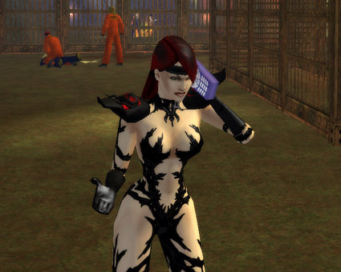
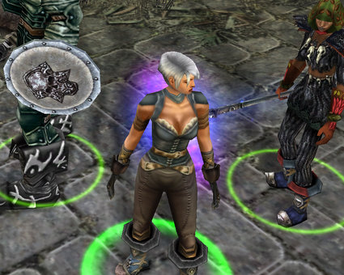
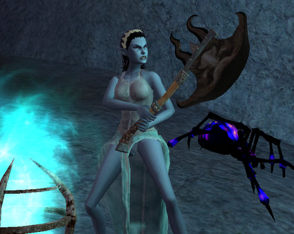
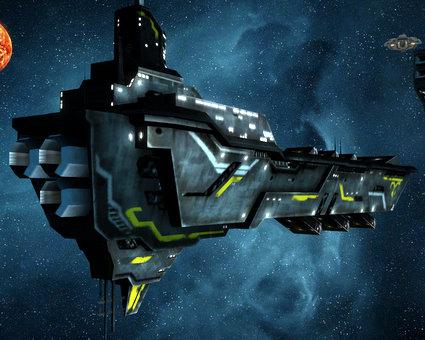
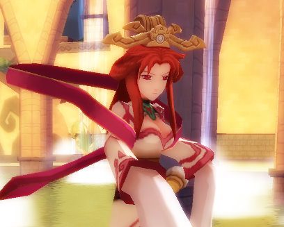
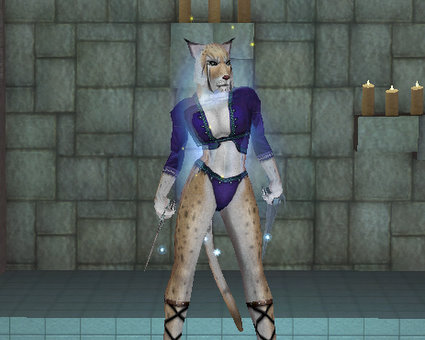
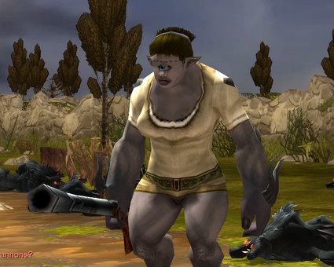
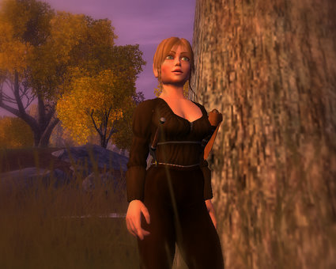
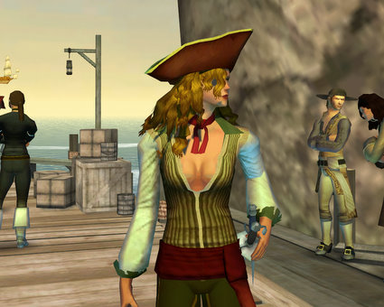

# Bad article ideas: MMO Pinup Calendar

*Posted by Tipa on 2008-03-31 08:05:59*

It's been a little over a week since I started blogging over at Massively, and while I am really enjoying myself, I think I still have a lot to learn about story ideas. It's all about the page views, right, and what brings in the eyeballs better than our dear old friend, porn. So I suggested this to the editors, and they pretty much informed me that they already had plenty of Second Life coverage, and maybe I could work on this piece about "Shoulder armor through the ages -- how high is too high?".

"No no no!" I cried. Well, typed. "What if I just go to various games, undress my own characters, and make a calendar from those pictures?"

Blank stares. Let me give you an idea: Concrete floors have more expression. So, grumbling beneath my breath, I vowed to do that article and show them just how good an idea it was. Here, then, for your enjoyment: Massively Multiplayer Women. (They didn't like the title, either... hadn't they ever seen Age of Conan!!!???)

**City of Villains**: Sometimes, it's not what you wear, but how you wear it. Black Oyl was a petroleum researcher at Texxon when she fell into a tanker full of $110/barrel crude. This would have been fatal if the light of the [brightest Gamma Ray Burst ever recorded](http://www.nasa.gov/mission_pages/swift/bursts/brightest_grb.html) hadn't hit Earth at that precise moment. Black Oyl emerged from the tanker wearing a dollar's worth of oil on a five dollar body and fights oil executives by seeing that their stretch limousines are detailed poorly in the Houston luxury car wash.

**Dungeon Siege 2**: "But DS2 isn't even an MMO!" pointed out the editors. Always blocking my flow with details! You've heard Chalice Eversong's story a thousand times, it's the kind of growing-up story everyone can relate to. You and a friend get drunk one night and sign up as mercenaries for an evil army, and even though you really suck at fighting and get your butt kicked by *tree branches*, somehow, it turns out you're a legendary hero and are the only one that can defeat your boss. And then your boyfriend dies, you get captured by tree people, forced to do menial labor all the time, blah blah blah, it's happened to all of us. Chalice just wants to show that just because you're prophesied to save the world doesn't mean you can't let your hair down with your party once in awhile. Hey, that's why it's called a PARTY!

**EverQuest 2**: "I'm NOT doing this!" yelled Nashuya. "Oh, yes you are," I said, as I stowed her armor, bit by bit, in her pack. "This is a GREAT idea for an article, and you're gonna just have to grin and bear it!" This was before my editors said that actually, it was a crappy idea for an article. Nashuya's blue-tinged skin positively glows in the light of the corpse-flames of Fallen Gate. Nashuya protests too much. Way back when EQ2 first came out, player characters were assumed to be shipwreck survivors without a penny -- or armor -- to their names, and looked just like this until they did some quick armor quests. Now new characters come complete with armor, weapons, and a selection of promising spells and combat abilities. It's just like being back on newbie island, Nash!

**Sins of a Solar Empire**: Yeah, I know. Don't start with me, okay? The Kor Battleship "EDS Eliza" is two kilometers of the meanest hunk of ship in three systems. She appears here clad in nothing but ten meter thick electro-strong neutronium plating. She'll give ya the ride of your life and then kick you back to that ice planet with the arctic research lab from which you came.

**Dream of Mirror Online**: No, this ISN'T my character. DOMO characters are CHILDREN. What kind of pervert ARE you? This is one of DOMO's Mirror Kings. Yup. In DOMO, even the guys look hot. Boys and girls alike can look forward to what they can become. And, yeah, this may look like some high-end animated cartoon, but this is actually what DOMO looks like. Pretty cool, huh? 

**EverQuest**: Relaxing in the guild hot tub, Vah Shir beastlord Shinai Oftheancients lets her guard down for this candid shot. Her name.... well, that's a long story. See, we had this guy in the guild that wanted every single weapon that dropped that he could use. The weapon he wanted more than anything else in the world ever was one called the Shinai of the Ancients, which dropped in the Plane of Time. So prior to every PoT run, he'd send tells to every other person who could wield it and ask them to let him have it. He would also helpfully suggest to officers that he deserved to be given it outright, should it drop. So I made this beastlord, named her Shinai, got her to level twenty so she could have a last name, got an officer to invite her into the guild and proceeded to wonder, loudly, where my weapon dropped. Fun times!

**Mythos**: Wuvwy Angel is just a large cyclops in a small world. Since, in Mythos, player characters are monsters (gremlins, satyrs, cyclops and most monstrous of all, humans), Wuvwy can't complain about not being understood. She just has trouble getting people to see her soft, feminine side. Me? I've never seen anyone prettier. Nobody can wear a torn nightshirt like she does! Now, put down the gun, please? Oh yeah -- open beta soon, guys.

**Vanguard**: Huh? This IS undressed! In the Victorian-age sensibilities of Vanguard: Saga of Heroes, the best skin is covered skin. Tipa is a fantastic bard; you might even say she's outstanding in her field. Get it? She's actually *out STANDING in her FIELD*! *Cough* sorry. Am I done yet? Oh, one more?

**
Pirates of the Burning Sea**: Liz Strickland is dressed for the Caribbean SUN, but what she likes best is the Caribbean FUN. Stepping off her Bermuda sloop, the first thing she asks the dockmaster is where the heck the disco is in this rat-infested excuse for an outpost of the glorious United Kingsom. When the sun goes down in the British Empire, baby, the lights come UP.

---

Well, anyway, you can see what a brilliant idea this was. The editors just don't understand me. Tomorrow, another article they rejected: Implementing the I WIN! button in World of Warcraft.

