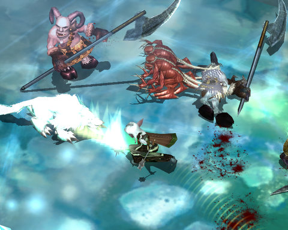

# Mythos hates hybrids

[Mythos](../index.php/category/mmos/mythos/) will be hitting open beta "real soon now", so if you haven't already, you'll have your chance to get into some free-to-play, Diablo-inspired, [action-MMO-RPG fun](http://www.massively.com/category/mythos/) within weeks. When you get there, though, there's one thing you really, really have to know when you begin to build your character.

Mythos hates hybrids. It's sad!

The nasty part is, you might not be aware that you ARE building a hybrid. I'll explain.

Your three major stats in Mythos are Strength, Dexterity and Wisdom that are the prime attributes for Bloodletters (your melee class), Gadgeteers (your ranged class) and Pyromancers (your nuker). Your actual abilities are independent of your stats -- you get them through Diablo-esque talent trees as you level.

You are building a hybrid whenever you make a cross-spec build -- a str/dex bloodletter who attacks from range (and uses a hybrid weapon like a crossbow or a polearm); a dex/wis gadgeteer who tosses nukes in with the bombs and rifles; a str/wis pyromancer who plants a lot of persistent effects then wades into the fray. I was a str/dex bloodletter; I was polearm specced and relied on my pets to keep things busy while I sliced off their heads/vaguely head-shaped things from the rear. The problem wasn't the weapons so much; except that *good* hybrid weapons were really rare, and I found myself using the same one for about ten levels -- now it was a really good weapon, but Mythos is centered around constantly upgrading your loot and armor. Still, that wasn't the problem.

There is almost no hybrid armor or jewelry. If you want the really good stuff, you'll find it's very high in strength, dexterity or wisdom. The rare hybrid stuff -- like a dex-based belt that adds str -- usually is so high in one stat (dex) that it can't be worn by someone with balanced stats. As a result, I have a lot of stuff banked in the hopes that I will eventually become high enough in one stat to wear it. My Red Hand Bloodletter (the pet-based sort) eventually had to be abandoned because Red Hand is a mana-bound tree (keeping pets up takes increasingly more and more mana and hence Wisdom), all my gear was str/dex, and because of the rarity of hybrid gear, I was way behind, gear-wise. I respecced from Red Hand to Martialist because I didn't have the mana or mana regen to support the old spec, but because my strength was so low, I was nerfed from the start. A non-viable character.

It might be fun to play with a hybrid character in Mythos, but... don't. Choose a stat and stick with it. That way you will have more flexibility to choose items with +Luck on it (your ticket to uber items) rather than ones that desperately try to prop up your fail. It was so bad in the end that if I accidentally took off the wrong item, all my weapons and certain bits of my armor would turn useless, and I would not be able to put the thing I'd taken out back, either, so I'd have to use intermediate pieces of stat-raising armor to get everything back on again. It was PATHETIC.

