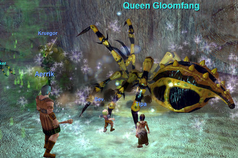
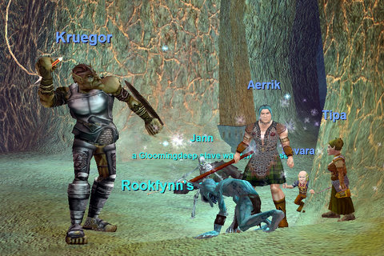
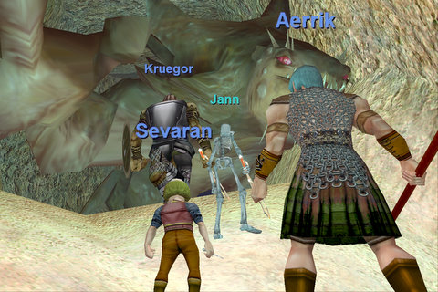

# Nostalgia the Tutorial

It was a wild, exhausting first night for our EQ Nostalgia group. We had more show than could fit in one group, so we made two and went our separate ways. The beginning bit with the spiders -- didn't really need a group for that. So things started slow. They picked up when we got to the kobold area; the fight against the giant beast Krenshin definitely capped the evening! The kobolds also dropped a lot of very nice Gloom armor that quickly prepared us for the wider world.

When we finally did manage to leave the tutorial and explore the wider world -- that's when it first really hit me with nostalgia. I felt at home again. And not anything like I feel when I play my old cleric main. There I feel like I should be farming something or working on faction or trying to find a raid guild or just plain working at something. In the Nostalgia group, nobody wants ANYTHING from a level 10 ranger. The freedom of the noob, I guess.

First named of the evening. She isn't as bad as she looks.

Die, goblin lord, DIE!

Krenshin FALLS! He was red to all of us. I don't know how Aerrik kept us all alive.

Neat thing about EQ is how it puts you RIGHT into the action. Grouping, making teams, learning to work together and fighting really challenging things -- in the TUTORIAL, if you can believe it. If only WoW and EQ2 could learn that lesson instead of saving it for so late in the game.

