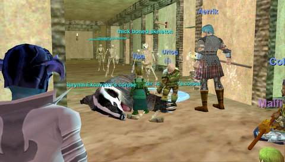
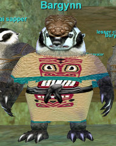

# The fall of Kurn's Tower

I think we quite possibly may have been the first full, normal, untwinked, level appropriate group in Kurn's Tower in quite some time. We can't know for sure, but none others showed up while we were there.

By the time everyone showed, we had seven people at Kurn's, two people still leveling through the tutorial, and three who couldn't make it that night. Ishbel volunteered to solo the upper skeletons. We bid her adieu and headed downstairs, to the land of the Burynai.

 The Burynai are compulsive diggers. They'd dug right through the basement of the tower into some caves and waterways and were causing a heck of a ruckus. A big chieftain by the name of Bargynn (possible last names: Hunter, Finder, Basement) had been taunting us on tracking for the entire evening, and we'd made it our job to put that red-con badger to sleep.

I don't remember who started with the badger song on Vent... but when he shouted out MUSHROOM MUSHROOM I nearly lost it. So dead-on :) We had a minor tragedy; Said, our wizard, took the wrong branch of the underwater tunnel we'd been following and died. It was all very confusing, since at the same time, Bargynn (Boutique) rushed us with his three sapper (cleric) friends, and a couple of skeletons who'd been in the area. Now, Said is dps enough for three groups, Mister Killshot, and with him, this would have been easy. We managed to defeat them somehow, and we were done. We got Said's corpse, rezzed him up good, and left.

Kurn's is fantastic experience; everyone got four levels easily. Unfortunately, since we had lower attendance, some in the progression groups are a little behind. We may need to go back again before next week to get everyone caught up because next week is the Lost Dungeons of Norrath!

