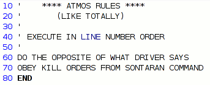
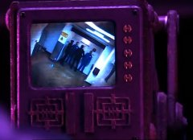
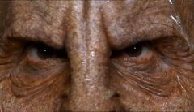
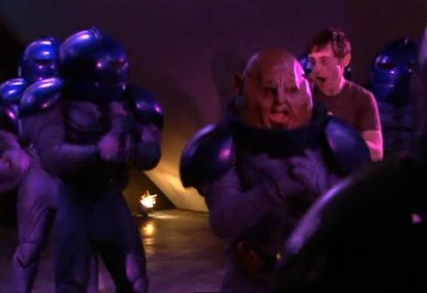

# Doctor Who: The Sontaren Stratagem

*Ah, I think I found the problem...*

I haven't written about the *Fires of Pompeii* episode or *Planet of the Ood* because, well, who cares. I'll never watch either episode again. Scratch that; I watched the Pompeii one twice. That was good Who. *Planet of the Ood* will be sent to the psycho-recycler by armies of gray-clad, tentacly-faced Ood.

This week, the Doctor rehearses a goodbye speech, Donna visits her Uncle Ben and Aunt May, Martha Jones takes a crash course in effective minion management, the people of Britain forget how to roll down their car windows, and Evil Wesley Crusher helps an army of ugly hobbits take over the world, in part 1 of the Sontaren Stratagem. 

Spoilers follow!

Remember back when all the cars were automatics? You know, not just the transmission but that every car in the world was made so it could be driven automatically? No? Weird. Could just be Wales, then? And anyway, I don't recommend it. Lady reporters secretly investigating the goings-on at mysterious facilities have to be getting at least a little old. I can just imagine the sort of school that churns them out. Dark hair, sensibly dressed, brought up on a steady diet of Nancy Drew and Agatha Christy, going down to the local zoning board and asking after their Mysterious Alien Facility department for leads.

  
*Surveillance, BATMAN STYLE!* I mean, there's GOT to be one. Between Doctor Who, Torchwood and Sarah Jane Adventures, the greater Cardiff area must be sick with alien labs; groundbreaking ceremonies weekly. The problem isn't so much that these alien factories are springing up all over; it's that their massive size and efficiencies of scale are driving out the home-grown, mom-and-pop Welsh mad science research labs. Making a monster in a shed in your garden? How quaint. Have you seen our VATS? Bwahahaha.

Rattigan (with TWO TEES!) Academy is a prestigious school for brilliant young teens with a fondness for San Quentin casual wear, presided over by an insane Wesley Crusher. Our dear Mister Crusher, berated by the Captain for once again trying to escape onto the Enterprise's bridge, has hatched plans to rule the world through efficient smog control. EVIL smog control. Yes. Beware global warming. But, this smog control also includes a navigation system which can direct you to all nearby rivers and lakes, and also take complete control over your car, whatever the make and model, in case you feel your holiday plans do not (yet) include scenic tours of local waterways, from beneath. As our plucky young reporter soon finds.

Wesley is, of course, American. All the best villains in British shows are American. Here in the US, all the great villains are British. That urbane sophistication, those clipped syllables, that nasally superior air... British Peter Cushing ordered Alderaan destroyed, but it was American James Earl Jones who tortured Han. Americans and Brits. Divided by sea, but bonded by evil.

We pop off to the TARDIS, where the Doctor is giving Donna driving lessons. Phone call from Martha! Apparently Donna just clipped her in the hyperdimensional bypass tunnel. Well, it turns out that she was just inviting the Doctor to a friendly alien invasion warehouse search.

 I mean, why even BOTHER calling the Doctor for that? The UK is ALWAYS being invaded by aliens. It's pretty near continuous. They have a huge waiting list for the permits. Downing Street only lets in a couple of dozen per year. Yesterday it was the Daleks, today the Sontarans, tomorrow, the Cybermen... there's just not enough Britain to go around. And yet, unsteady perhaps, feeling that perhaps she didn't really get as much out of the Weevil invasion as she would have liked, she calls upon the Doctor and down he flies. New vs Old companions handily discuss the Doctor's shortcomings as he teases his forelock an extra six inches away from his forehead... but the energy is slacking, and so it's time to call upon the Hobbits.

I don't remember Sontarans being so short, but it's been awhile. Anyway, there's not quite enough evil going around, so the Sontarans grow a quick Evil Martha clone, who stalks about menacingly as the Doctor, who turns out to have had a deep personal relationship not only with Donna, but her mum and her grandfather as well. Oh dear. Grandad has gotten stuck in the car, and the Doctor's tampering with the (evil) Atmos system has caused it to start spouting harmful greenhouse gases. 

And... next week, a ticking timer, a state of emergency, and (evil) teen geniuses looking on with glee.

  
*If you're evil and you know it, clap your hands...*

Can't rate this show without seeing next week's, but so far... come on. Alien invasions, secret alien factories taking over the world with (evil) consumer goods... The plot of every other Doctor Who episode. 

Time to watch the Family of Blood again? Classic Who, that.

