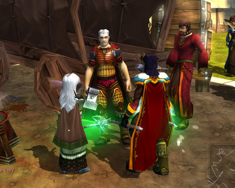

# Please, PLEASE Flagship Studios...

*Posted by Tipa on 2008-04-29 18:33:07*

I wrote an [overview of Mythos crafting](http://www.massively.com/2008/04/29/an-introduction-to-mythos-crafting/) this morning, you can read it if you like, but that's not what I'm pleading to Flagship about.

Please, PLEASE... let us play in the third person from-behind view like WoW and EQ2... Your game is so gorgeous from down here. I don't love Diablo so much that I'll be unhappy if you toss the overhead view for third person over the shoulder. And get rid of point-and-click in favor of WASD. Actually, I love the game -- but please consider lifting camera, movement and targeting controls from WoW or EQ2, either one, I don't care which.

It would be amazing.

