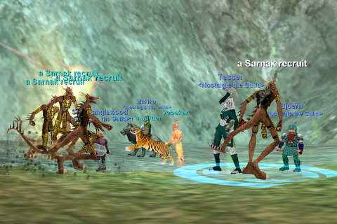

# Sarnaks by the dozen

*Posted by Tipa on 2008-06-11 08:33:43*

First of all, there's *no such thing* as a so-called "Tipa pull". For one thing, it's just more EFFICIENT to nuke something at a door and have the entire fort come after you in groups of three and four.

Look, what doesn't kill you, makes you stronger. Everyone dinged, no harm, no foul :)

The night started off slowly. We gathered at the Windmill in the Lake of Ill Omen, and the place was just a sea of red to our doughty druid healer Hakiko. Looking for easier prey for the three of us -- Hak healing, me tanking in my shiny purple armor, and Fada handling the perilous nuking duties -- we headed toward the spires camp.

Way back in the day, this was one of the most hotly contested low level experience camps in the entire game. Get a spires group, and you would level. The spires are columns sticking up out of the water from the submerged ruins of the once great Iksar city of Veksar. Perhaps looking for a way in, Sarnak, goblins, Iksar exiles and the occasional wandering undead used to pass by. But last night when we got there -- nothing. We moved up a little bit toward the hills and found a steady supply of mobs until Bjoern and Tesser logged in and beefed up our group power quite a lot.

Skinning cats wasn't heroic enough for such a GOOD looking group, so we fought our way to the Sarnak fort. This has become the Sarnak fortress of Bathezid's Watch in EverQuest 2, but here, it is a provocative affront to the Iksar by the Sarnak, with the fortress sitting as it does across the lake from the Iksar capital city of Cabilis. The Sarnak High Chancellor asserts his control over the entire area. The Iksar, sit and brood in isolation.

And he took little notice of the group of adventurers camped at his doorstep, killing his recruits (and the occasional officer) last night. Chain aggro is the way of things there, and every simple pull would turn into hair-raising, complicated affairs. Lay of Hands got pretty much it's first "on purpose" use (usually I try desperately to heal mobs by accident). By the time it was 9PM and time to pick up my daughter, visiting from California, I think everyone had gained at least a couple of levels.

No death, lots of experience, and a visit to an old zone where we spent so much time back in the day... the night could not have gone better!

