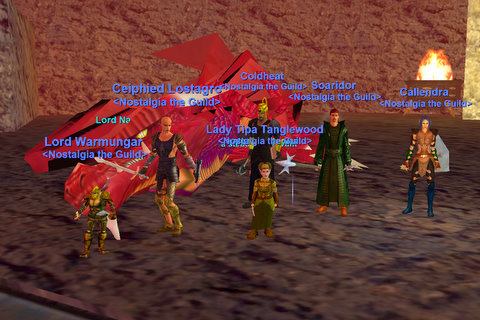

# EQ: The Half-Baked Half Dozen

It's weird, but whenever we have the perfect dragon killing strategy, the people who make it possible don't show up the next week. Last week we used a gnome (we've determined gnomes are extremely important as bait) and translocate to pull Naggy's room and port the puller safely elsewhere. With no izards last night, we were a little befuddled until Callendra suggested using the druid's one translocate to Blightfire as a substitute, and this kinda worked when Soaridor put this into practice.

Things never worked out entirely as we liked; I ended up kiting Naggy while the others put the hurt on some giants, where I died. Then I snared Magus Rokyl while he and Naggy were beating on me so that they would split, so I died. But then I AM a ranger, after all. My job is to die in useful ways; I know that. But we ended up with Magus Rokyl snared in the lava and Naggy in his lair and half the group fighting their way back from evacing, and when Magus Rokyl decided he was tired of his refreshing magma bath and came after me, I was able to root and snare him until everyone was together and we could kill him, so that was nice.

As we recovered, a level 70 warrior came up asking to watch. PRESSURE! I don't know what he thought when he saw all our looted corpses cluttering the ready room. We buffed up, hauled out our steadfast servants and headed in. And... no deaths. People were low on mana, REALLY low, and some people were very near death, but everyone was still standing when Lord Nagafen turned to run.

Fantastic tanking by Ceipheid and new uber warrior Warmunger, amazing healing by cleric-under-pressure Coldheat and druid-for-the-ages Callendra, and Soaridor for being the night's sacrificial puller :)

Unfortunately, Naggy didn't drop the red dragon scales, so we'll be back again, and hopefully in greater numbers. He was otherwise pretty generous with the loot, though.

[Cloak of Flames](http://lucy.allakhazam.com/item.html?id=11621) -- Tipa, improving slightly on the RBB I won last week. RBB will go to guild bank. How I love non-attunable loot!
[Gauntlets of Fiery Might](http://lucy.allakhazam.com/item.html?id=11624) -- guild bank.
[Bladestopper](http://lucy.allakhazam.com/item.html?id=11632) -- Ceipheid, iirc.
[Selo's Drums of the March](http://lucy.allakhazam.com/item.html?id=11626) -- guild bank.
[Torn, burnt book](http://lucy.allakhazam.com/item.html?id=19071) -- I looted to turn into a Book of Scales to sell for guild funds.
[Treasure Hunter's Satchel](http://lucy.allakhazam.com/item.html?id=17702) -- Callendra

