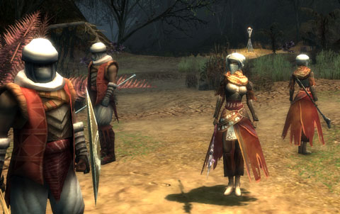
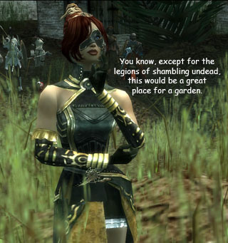
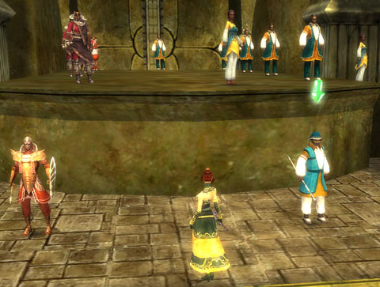

# Guild Wars -- Day 2

So before Guild Wars kindly implored me to log off after a mere four hours playing (and how kind of it to be so concerned for my health!), I had cleared out every single quest, aside from the main storyline quest, in my quest journal. Monuments had been protected. Salads had been made. Sentient seeds had been traded. A guild invite had been rejected (after I did some research in how to reply to tells... was the first time I had ever spoken to someone in the game). Forlorn lovers, brought together. Wayward children, found and brought home.

And the Sunspears were grateful. So grateful were they, that the Sunspear scouts would no longer give me bounty buffs. I guess once I became ***SUNSPEAR CHAMPION*** (woohoo), I was above such things as "promotion points" and "experience" and "loot". I did learn that my party takes a share of loot, and that in a full eight character party, I am getting 1/8 of the loot that drops. Which seems unfair. For some of the rarer drops, I had to boot everyone from the party and go out hunting alone.

Just me and my giant, eight foot, pink flamingo. Of DEATH.

Now I know why people are always talking about "farming builds". You need to go solo so you can get the loot. But that's okay. I'm set on loot for now. I crafted all my level 15 armor and a new weapon and have stacks of raw materials in my storage vault for the next tier.

At level 18, I was ready to take on the main quest once again and save the world. After... I did some recruiting.

Is it like this in the real military, where just before you get shipped out on important missions, you have to go recruiting? Well, that's what they had me do, anyway. I had to placate some visiting dignitaries by agreeing to train one of their students. And THEN I had to go running around finding new Sunspear recruits, without letting them know the fates of the Sunspears they are replacing. Naturally, none of the recruitees would be at all available unless I took care of the critters that had been hanging around forever, eating children and the such.

I went back and mastered the Apocrypha mission, then moved on. In this mission, which I had to do twice due to not completing one of the bonus mission objectives, you find a corsair delegation, KILL them, dress up in their clothes (first pic), talk your way through some Kouran guards (Koura is an ally nation who is really your enemy but nobody on Istan knows that, officially), and this is important, KILL EVERY SKALE IN THE AREA for the occasional Rhiktul monitor lizard that hangs out with them. Okay, no, I don't know what this has to do with a clandestine meeting between the corsairs and the Kourans. But you only get 1/3 swords for completing the mission if you don't kill them.

Anyway, once you meet up with the Kouran spear marshall, the mouthy monk you were forced to bring along starts spoiling the whole thing by flinging off her disguise and vowing to kill them all. So, yeah, we're kinda forced to fight with our lives from that point. That was NOT part of the plan, and the Sunspears back home are LIVIDLY ANGRY. They know nothing about any corsair/Kouran conspiracy, and so it's off to face the Tribunal.

There's a couple of progress bars on the left which shows how well your case is going. Each person you summon to the stands makes your case worse. Every statement you make regarding the facts of the mission are twisted and distorted. All seems lost until Tennoli (the mouthy monk) brings Kosmir back from the hinterlands, and she puts a quick stop to the kangaroo court. Because she has PROOF the Kourans and the corsairs are in collusion, and she knows what Nightfall is.

And that was the end of Day 2. Level 19 and about dive more into this dark conspiracy. I haven't changed my build, it's still working out fine, and I think I have to get access to more skills before I can really start with the complicated builds.

There's little hints that I will be sent to the mainland soon...

