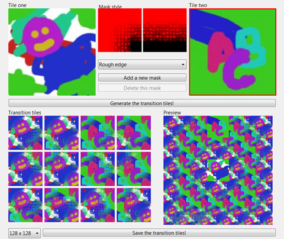
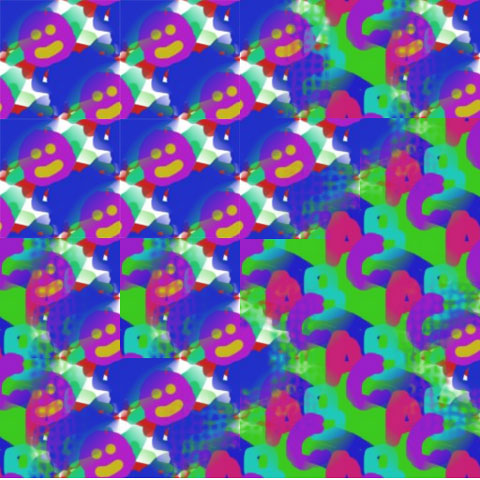

# Metaplace Transitions

Was checking up on Metaplace's progress -- Areia will always be in my heart as the one game developers who actually read my resume -- and got to playing with their tile transition tool. It does two things: Makes any pattern tile with itself, and then calculates transition tiles to smoothly transition from one tile to another.

It's meant to make it easy to construct tile-based landscapes, either the 2D ones like in the Legend of Zelda, or the 2.5D games like Ultima Online and other isometric games.

Naturally, my tiles would be pretty bad for something like that... but the tool does work. And in Windows or OS/X!

