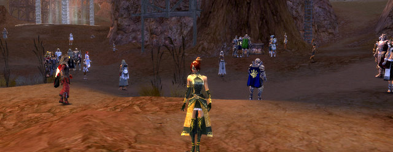
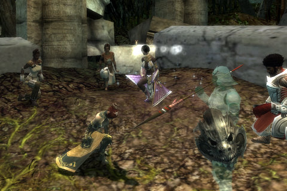
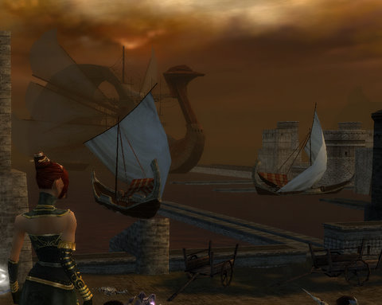
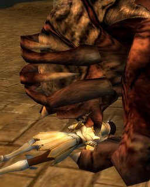
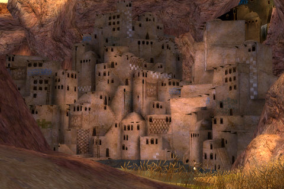
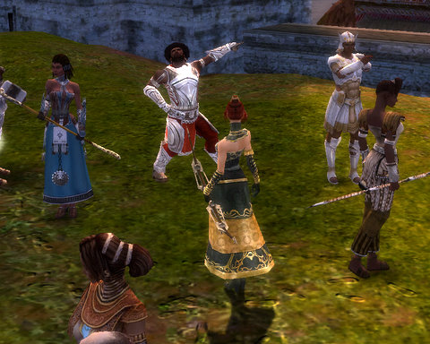

# Guild Wars -- Day 3

Okay, this is skipping ahead a bit, but I'm so mad. I basically manage to single-handedly hold the Sunspears together after Spearmarshall Kosmir became demon-chow. Veshta totally killed us. We fled to some caves -- caves filled with vermin! Huge bugs! Koss was kidnapped! So I pretty much had to do it all myself. Afterward, I was totally the hero. It was MY place. MINE.

So WHERE THE HECK did all these OTHER players come from? *I* didn't invite them!

Sigh.

Okay, wayback machine time.

When we left back at Day 2 (and sorry for no Day 3 last week, I was at the SOE Fan Faire), I was level 19 and finishing up all the quests I could find before I moved on.

Today, I lept right into the fray. The Castellan in the Sunspear castle gave me three tasks that I needed to complete in order to prepare for the battle against Koura that was sure to come.

The first task was to bolster the army by going to the Sunspear Tombs and enlist the help of the dead. Which is kinda weird because, hey, they're DEAD. They probably got dead by LOSING, and I doubt death has given them many opportunities for training, except for training in decomposing or providing homes for worm colonies.

But hey, I'm not in charge (yet), if that's what i gotta do... so I went to the tombs and knelt in front of the gate, and a Sunspear warrior appeared -- and attacked us. Just as a test. And guess what -- we WON. EASILY. I DON'T see how much help a bunch of dead warriors will be when their leader can't even put up a decent showing against a bunch of newbie adventurers.

So, color me dubious.

The second task was to train some recruits, which just involved taking them bug hunting. But they would come in handy later (although not handy enough to change the outcome of the battle in which they took part).

The third task was to obtain the blessings of the wind gods to give us safe passage from Istan to Koura.

This involved summoning the wind spirits -- and killing them. See a little pattern here? After we killed enough of them, they promised to speed our ships on their way. Which is really interesting, because we basically kicked their butts. We kicked ghost butt at the Sunspear tomb, wind spirit butt at the docks, and we expect these people to HELP us?

Well, I think we have to really wonder about the quality of help we will be receiving from them. Or, who they will be helping.

Anyway, tasks done, we formed up on the docks, marched into the ships, and the wind spirits sped us to Koura.

Ah, the sounds and smells of battle. The crash of high-flung stones plowing through the troops. The screams, the blood, the horrid monsters, barely controlled by their summoners. The thrill of victory.

Not, of course, OUR victory. Not even MY victory.

Oh, we were well-routed by forces beyond our control. The wind spirits brought us here because they knew what we would find here. Our own deaths. The Sunspear dead must have been nearby as well, to carry their dead back with them to their eternal rest in the Sunspear Tomb. They carried Spearmarshall Kormir with them.

We started off well, going from place to place, easily defeating the enemy. One of the new recruites even figured out a way to turn the bombards against the city, opening its heart to us. And so we rushed in, certain of victory. Spearwarden Veshta of the Koura, though, summoned the power of the disgraced Sixth God, Abaddon, and four demons appeared. One bit through Kormir, and busied itself swallowing her from the inside out. Those of us that lived ran and ran and ran. Most of my squad survived, but Koss was gone. Dead, captured or scattered, we didn't know. But as the days and weeks passed, as we Sunspears stuck on Koura looked for a place where we could stop running and regroup and no word came, we had to come to terms with his loss.

I chose an anonymous henchman to take the place of the boisterous, fun-loving Koss.

We Sunspears and Istan in general aren't any too popular on Koura. A lot of the people think we got what we had coming to us on the Consulate Docks. Donkoro, who thankfully had managed to escape with me and had invaluable wisdom to share, suggested a friend he knew. That friend wanted nothing to do with us, but he did know of a cave system which would be perfect, if bugs hadn't overrun it. Perhaps we could...?

Oh, yes we could. I eat bugs like that for breakfast.

Um. Not really.

With the caves cleared, the Sunspears that survived the rout trickled in (and opened a new hub). We took on odd jobs. While interrogating a Kouran scout, we heard tell of some prisoners that had just been captured. Koss? No, these prisoners were all dead, and the villagers who had been healing them were themselves arrested.

We freed them, but they hadn't seen anyone like Koss. Although.... there were rumors of some very important prisoners at a castle on the coast. We soon found out that Koss was alive, and among them. KOSS!

What do you think? Of course we rescued him!

After that, I spent a few hours working on random quests. I got my first elite ability, Simple Thievery, from a corsair named. He had a regular skill I don't have yet on him, so I might go back for that one, except that it took a very long time to fight down that deep. So: level 20 -- would be like 22 if I were still leveling, but that's two more skill points to use. Opened a new hub with a new advanced weapon crafter (haven't found armor crafter yet). I can now change my secondary job, have a new hero skill trainer and a new regular skill trainer.

I only got two blades on the Consulate Docks mission because I couldn't find the last field marshal units before I accidentally triggered the final encounter, so I'll have to go back and do that again. I am now a Sunspear General and well into the main portion of the game. Sixteen missions to go in the main plot, but I'm taking my time and doing every side quest so it may be some time before I finish Nightfall.

