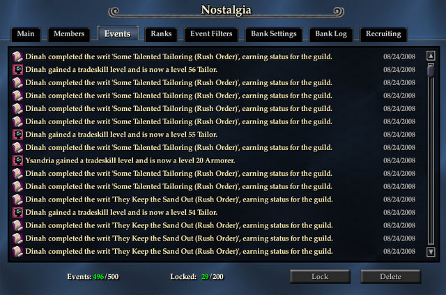
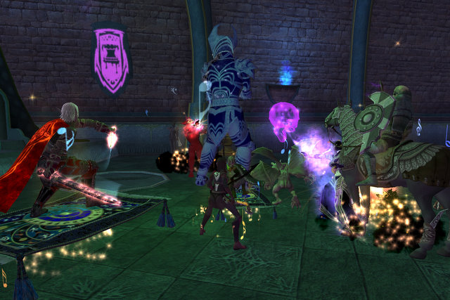
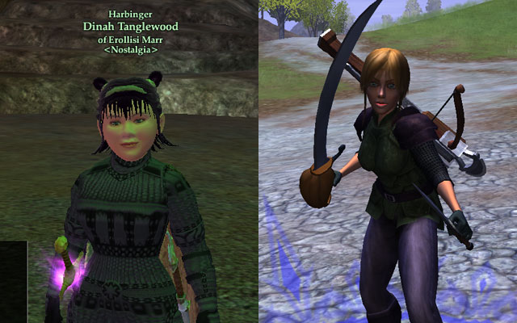
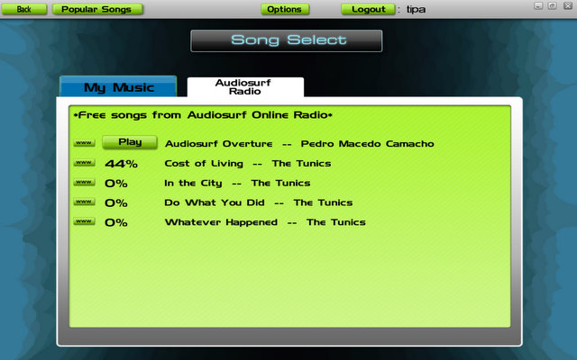

# Weekend Gaming

*Posted by Tipa on 2008-08-25 01:54:55*

I didn't just play Guild Wars this weekend. I stopped into Wizard 101 a little, and, oh, finally got around to moving Dina from Befallen to Najena, where she happily joined Nostalgia. Almost as soon as I got transferred and reset my AAs, I got a group invite to Runnyeye 2. Who was going to be the enchanter for the run? Me. Yup, troub mezzes were going to be the only thing between us and total annihilation. It got a little nervewracking on the final epic x2 mob, since the usual strat is to mez all the adds, kill the boss, then kill the adds. Well, I can only keep two locked down. Three with no resists, but that's iffy. The group leader figured out a strat where only two needed to be mezzed at a time, we did it, and we won.

Vindication for troubs in groups :) The main tank had actually never grouped with a troubadour before, and wanted to know what, if anything, troubs could do that was useful. Well, troubs can mez... that should be good for something. By the end of the run, everyone in the group had learned the pleasure of Song of Magic, Countersong, Perfection of the Maestro and Jester's Cap as well. 

I won a Brigand master in the group, Dispatched. I sold it within minutes for 400p. Unfortunately for me, troub masters on Najena are so expensive that even with 400p, I would only be able to buy a couple of the more useless ones. So I opted to not buy any of them. Unless I am planning on raiding, I don't really need them if I have Adept 3 spells.

Today, before I started with Guild Wars, I took a couple of hours to rearrange my bank, get all my crafting materials set, put what I didn't need on the broker, and get my tailoring from 52 to 56, taking advantage of the double xp weekend, a full bar of tradeskill vitality, and two Drafts of the Skilled.

Next time they have a double xp weekend, I'll finish it up to 60. But Tier 6 tailoring is so mind-blowingly awful, that I want every possible benefit I can get before I put shuttle to loom.

I stopped into Vanguard a little because I'd heard they finally updated the character models. So on the left, you see my bard in EQ2. And on the right, my bard in Vanguard. It should be noted that both halflings are fair skinned. This is part of the reason I don't play Vanguard much. My character creeps me out.

Played some wake-me-up Audiosurf. Since the last time I played, they have started adding new artists you can download and play to -- today, "The Tunics", a pretty good English indie-style band. You can send the songs you play to to Last.fm, and you can see a quick list of which songs you are the champion on. So, some nice new stuff.

I also finally joined Xfire. I'm tipadaknife there, if you want to add me. I'm Tipa on Last.fm if you want to friend me there, and if you want to add me on LinkedIn or Facebook, let me know :) Or if you know my real name (no huge secret, but that doesn't mean I want it grabbed from here by a spambot), well, use that for LinkedIn and FB.

