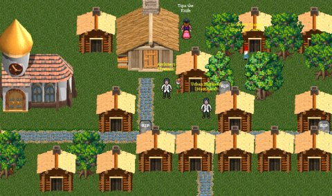

# Golemizer -- first look

*Posted by Tipa on 2008-09-17 00:49:20*

Just an update to the previous post. I had a chance to walk through a little bit of [Golemizer](http://www.golemizer.com), the AJAX/JavaScript-based MMO where you craft golems of ever-increasing deadliness to wreak your will upon the world -- if all the other mad scientists don't beat you to it.

Everything you see, can be crafted. Even some of the animals are mechanical copies. The tutorial teaches you to build your first golem, a cute little clockwork gnome, and along the way you end up with a house, building a forge to put in the house, making a shopping-list full of parts for your gnome, and setting your gnome free to make a dent in the bunny problem.

If you can find him. Most of the time, I'd set my gnome running and it would just hide somewhere. He was so cute though, and I loved him to death, before someone else's clockwork gnome walked up and bit me to death.

BAD GNOME! BAD!

So anyway, I guess it's full-on PvP.

Since everyone has the ability to make buildings, and with a little time spent studying and harvesting, HUGE buildings, the very first thing you notice is how crowded the place is. To find a free spot for your own home means going a couple of screens away. And then, the houses look identical, so it's a chore to remember which is yours. Not that it's totally vital -- most of the houses there will be like one another, an empty 10x10 house with nothing in it but a forge.

The concept is cool -- build golems and battle them -- but I wonder if an MMO, especially a JavaScript-based one, was the best genre for the game. One that focused purely on making your unique golem and then battling them one-on-one or in an arena of some sort could really be quite fun. As an MMO, though -- if I want to construct and fight golems, I wonder if I am really going to be all that thrilled about building houses.
