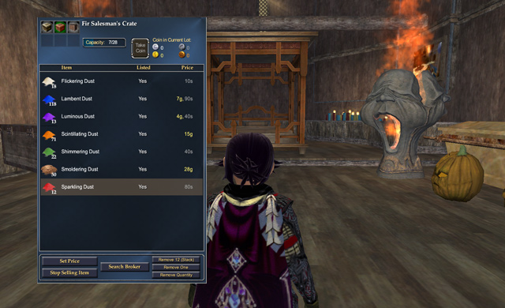

# EQ2: Getting out before the crash

*Posted by Tipa on 2008-09-19 14:23:20*

Taking action before the GU49 changes no longer requiring rare dusts (the by-products of making Adept III spells) for raid-level cure potions, I dumped all the dusts that had been ~~gathering du~~... sitting around in my bank and listed them all on the market.

I was going to save them to make mastercrafted poisons with on my alchemist, but my alchemist is still on Befallen, so there's no real reason to keep them.

I made over eleven plat in just a couple of hours of selling (of course, I undercut everyone else's prices). That brings Dorah up to a grand total of 19p with which to finance her move to Qeynos and new employment as a conjurer.

While it's true I dislike LAG-nos on general principles, I always did enjoy the happy halfling and gnome village of Baubleshire. The only thing that keeps me back is the possibility that I might still need max faction with the Coalition of Tradesfolk, the Freeport crafting society, for something, and there's no possible way I am going to be spending all those nights getting max faction with Ironforge. If I can still sneak into Freeport when necessary, that would be fine.

I'll have to check up and see if any other max faction crafters have betrayed, and see how much of a downside it really has.

