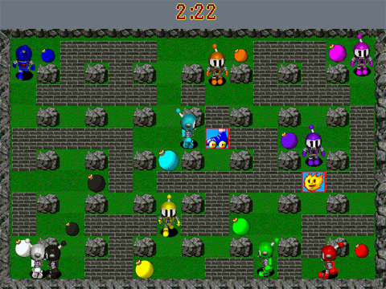
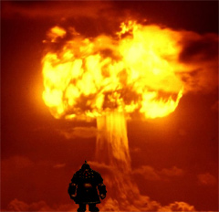

# Straight Talk Warhammer: The Dwarf Engineer

*Posted by Tipa on 2008-09-24 07:55:04*

Ever since Blizzard created the MMORPG genre with World of Warcraft, generations of people wondered if the genre they invented would end with that game -- it was just so good, such a shining gem of perfection, that to add or subtract any one thing to that game would just mar its sublime beauty. 

And then Mythic dreamed of a new game, one as polished as WoW, but with things WoW had never imagined, like two sides forever at war -- at WAR! -- and battlegrounds where the two mortal enemies could meet in order to take on well-defined challenges for points. The name of this paragon of innovation?

None other than Warhammer Online: Age of Reckoning. That's WO:AoR, which is kind of like how a ghost would say "war". And there's no WAR class better at turning people to ghosts than WAR's own little mad bomber, the Dwarf Engineer.

  
*Simulated Warhammer screenshot.*

A dwarf engineer walks casually out of a post office, schoolhouse, shopping center, whatever. He scratches a match to fiery life on the back of his knuckle, lights a cigar, and -- BOOM! -- terrified screams are brought to a sudden end as the entire building goes up in flames. He takes a deep drag from the cigar, smiles, and walks slowly away.

Because Engineers don't kill people one at a time. An Engineer isn't happy unless he is killing people by the dozens. An Engineer isn't happy unless he's destroyed the peace and happiness of an entire nation.

Try and turn away all dwarfs at the border, and they protest and call it 'profiling' and tie up the international courts for MONTHS. The is why you must fight dwarfs THERE so you don't have to fight them HERE. Take the fight to them. That's the only way to kill an Engineer. Hit them where they live, hit them fast, and hit them hard.

And you don't even want to KNOW what an Engineer can do with an eight ounce bottle of Listerene. Three ounce bottles of Listerene are okay, though. They can't do anything with those.

Dwarfs are really pretty skinny -- not many people know that they are wiry little guys and gals. Why do they look so round?

Reloads. A Dwarf Engineer was once apprehended by the virtuous agents of Chaos and found to be carrying three shot guns (one with a sawed-off barrel), ten grenades, enough plastic explosive to level a city, three bandoliers with two hundred shells each, a dozen detonators, two rolls of duct tape and a hundred meter spool of copper wire.

They would have had more, but they'd just been running down to the corner store for matches.

---

*Holy smokes! We've come to the end of another edition of Straight Talk Warhammer! Come back tomorrow, same time, same place, when we discuss the Dwarf Engineer's less psychotic cousin, the Rune Priest. Remember, if it's Warhammer, and it's Online, there's only one place to get the Straight Talk about it.
*
